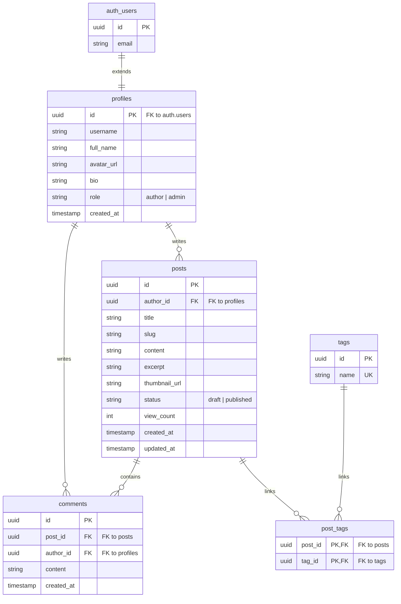

# BÁO CÁO TOÀN VĂN ĐỀ TÀI NGHIÊN CỨU VÀ XÂY DỰNG
## ĐỀ TÀI: THIẾT KẾ VÀ PHÁT TRIỂN HỆ THỐNG QUẢN TRỊ NỘI DUNG (CMS) VÀ BLOG CÁ NHÂN THỜI GIAN THỰC (ANTIGRAVITY BLOG/CMS)
**HỌC PHẦN: CHUYÊN ĐỀ CÔNG NGHỆ MỚI TRONG PHÁT TRIỂN PHẦN MỀM**

---

### TRANG BÌA HỘI ĐỒNG KHOA HỌC

*   **TRƯỜNG ĐẠI HỌC ĐÀ LẠT**
*   **KHOA CÔNG NGHỆ THÔNG TIN**
*   **BÀI TẬP LỚN / BÁO CÁO KẾT THÚC HỌC PHẦN**
*   **TÊN MÔN HỌC**: Chuyên đề Công nghệ mới trong Phát triển Phần mềm (CCNMTPTPM)
*   **TÊN ĐỀ TÀI**: Thiết kế và phát triển hệ thống quản trị nội dung (CMS) và Blog cá nhân thời gian thực sử dụng kiến trúc Next.js 14 App Router và hệ sinh thái Supabase (BaaS)
*   **LỚP HỌC**: CTK46-PM
*   **HỌ VÀ TÊN SINH VIÊN**: Nguyễn Việt Bình
*   **MÃ SỐ SINH VIÊN**: 2213831
*   **NGÀY NỘP BÁO CÁO**: Ngày 30 tháng 05 năm 2026
*   **GIÁO VIÊN HƯỚNG DẪN**: [Nhập tên giảng viên hướng dẫn của bạn]

---

### MỤC LỤC CHI TIẾT

1.  **LỜI MỞ ĐẦU & GIỚI THIỆU CHUNG**
    *   1.1. Bối cảnh lịch sử phát triển ứng dụng Web và CMS
    *   1.2. Sự dịch chuyển từ kiến trúc Monolithic sang Headless CMS và Serverless BaaS
    *   1.3. Đặt vấn đề và tính cấp thiết của đề tài
    *   1.4. Đối tượng nghiên cứu và phạm vi dự án
2.  **PHÂN TÍCH YÊU CẦU HỆ THỐNG (REQUIREMENTS SPECIFICATION)**
    *   2.1. Yêu cầu chức năng (Functional Requirements)
        *   2.1.1. Phân hệ Xác thực & Phân quyền (Authentication & Authorization)
        *   2.1.2. Phân hệ Quản trị bài viết (Author CRUD Dashboard)
        *   2.1.3. Phân hệ Tương tác độc giả (Realtime Comments Engine)
        *   2.1.4. Phân hệ Quản trị hệ thống (Admin Console)
    *   2.2. Yêu cầu phi chức năng (Non-Functional Requirements)
        *   2.2.1. Hiệu năng & Tốc độ tải trang (Web Performance & Core Web Vitals)
        *   2.2.2. Khả năng bảo mật mức thấp (Database Security & RLS)
        *   2.2.3. Trải nghiệm người dùng và Thẩm mỹ thiết kế (Aesthetics & UX Design)
        *   2.2.4. Khả năng tối ưu hóa tìm kiếm (SEO)
3.  **CƠ SỞ LÝ THUYẾT & CÔNG NGHỆ CHỦ CHỐT**
    *   3.1. Next.js 14 App Router: Cách mạng hóa kiến trúc Client-Server
        *   3.1.1. React Server Components (RSC) vs Client Components
        *   3.1.2. Cơ chế Server Actions và tối ưu hóa luồng dữ liệu
        *   3.1.3. Caching & Incremental Static Regeneration (ISR)
    *   3.2. Hệ sinh thái Backend-as-a-Service (BaaS) Supabase
        *   3.2.1. Bản chất PostgreSQL trong Supabase
        *   3.2.2. Cơ chế bảo mật phân tầng Row-Level Security (RLS)
        *   3.2.3. Supabase Storage và Supabase Realtime (WebSocket)
    *   3.3. Tailwind CSS & Ngôn ngữ lập trình TypeScript
4.  **THIẾT KẾ CƠ SỞ DỮ LIỆU & PHÂN HỆ BẢO MẬT RLS**
    *   4.1. Sơ đồ thực thể liên kết (ERD) và các ràng buộc dữ liệu
    *   4.2. Mã nguồn SQL khởi tạo Schema Cơ sở dữ liệu chi tiết
    *   4.3. Thiết kế các chính sách bảo mật Row-Level Security (RLS)
    *   4.4. Cơ chế đồng bộ hóa tự động qua Database Triggers & Functions
        *   4.4.1. Hàm trigger tạo hồ sơ tự động từ tài khoản Auth
        *   4.4.2. Stored Procedure tăng lượt đọc (RPC views counter) bảo mật
5.  **HIỆN THỰC MÃ NGUỒN CHI TIẾT (SOURCE CODE IMPLEMENTATION)**
    *   5.1. Cấu trúc thư mục dự án Next.js 14 App Router
    *   5.2. Cấu hình kết nối Supabase Server-side & Client-side
    *   5.3. Xây dựng phân hệ xác thực và bảo vệ định tuyến (Middleware & Auth Guards)
    *   5.4. Hiện thực các nghiệp vụ hệ thống qua Server Actions
    *   5.5. Thiết kế và phát triển Client Components tương tác trực tiếp
        *   5.5.1. Phân hệ Bình luận Realtime sử dụng WebSockets
        *   5.5.2. Quản lý tải ảnh trực tiếp lên Supabase Storage
6.  **ỨNG DỤNG TRÍ TUỆ NHÂN TẠO (AI) TRONG PHÁT TRIỂN PHẦN MỀM**
    *   6.1. Cuộc cách mạng lập trình viên đồng hành (AI Pair Programmer)
    *   6.2. Ứng dụng AI trong việc thiết kế cơ sở dữ liệu và viết mã SQL
    *   6.3. Giải quyết và khắc phục các lỗi logic, tối ưu hóa hệ thống bằng AI
    *   6.4. Các trường hợp thực tế và Prompt mẫu tương tác với AI
7.  **DOCKER CONTAINER HÓA & QUY TRÌNH TRIỂN KHAI THỰC TẾ (DEPLOYMENT)**
    *   7.1. Nguyên lý Container hóa và tối ưu hóa Dockerfile đa tầng (Multi-stage Build)
    *   7.2. Tệp cấu hình Docker Compose và quản lý biến môi trường bảo mật
    *   7.3. Quy trình deploy ứng dụng lên máy chủ VPS Linux thực tế
    *   7.4. Cấu hình Reverse Proxy Nginx & Tự động gia hạn chứng chỉ SSL Let's Encrypt
8.  **ĐÁNH GIÁ HỆ THỐNG, HẠN CHẾ & HƯỚNG PHÁT TRIỂN TƯƠNG LAI**
    *   8.1. Đánh giá kết quả đạt được đối chiếu với mục tiêu ban đầu
    *   8.2. Các hạn chế kỹ thuật hiện tại của hệ thống
    *   8.3. Hướng phát triển và mở rộng tính năng thương mại hóa
9.  **TÀI LIỆU THAM KHẢO**

---

## 1. LỜI MỞ ĐẦU & GIỚI THIỆU CHUNG

### 1.1. Bối cảnh lịch sử phát triển ứng dụng Web và CMS
Trải qua nhiều thập kỷ phát triển, World Wide Web đã chuyển dịch mạnh mẽ từ các trang thông tin tĩnh đơn sơ (Web 1.0) sang các nền tảng tương tác động đa chiều thời gian thực (Web 2.0). Nhu cầu lưu trữ, xuất bản và phân phối thông tin là cốt lõi của Internet. Để giải quyết bài toán này, các hệ thống quản trị nội dung (CMS - Content Management System) đã ra đời từ rất sớm. Những cái tên huyền thoại như WordPress, Drupal, Joomla hoạt động theo mô hình Monolithic (mã nguồn ứng dụng giao diện và cơ sở dữ liệu tích hợp làm một) đã thống trị thị trường web trong hơn hai thập kỷ, chiếm hơn 40% số lượng website trên toàn thế giới.

Tuy nhiên, khi quy chuẩn trải nghiệm người dùng tăng cao và sự đa dạng của các thiết bị đầu cuối xuất hiện (Mobile app, IoT, Smart TV, Web App), kiến trúc CMS truyền thống bắt đầu bộc lộ các giới hạn lớn về mặt hiệu năng tải trang, chi phí vận hành máy chủ, khả năng bảo mật thông tin và khả năng cập nhật thời gian thực.

### 1.2. Sự dịch chuyển từ kiến trúc Monolithic sang Headless CMS và Serverless BaaS
Sự ra đời của Jamstack (Javascript, API, Markup) đã khởi xướng cho kỷ nguyên phát triển web hiện đại. Trong mô hình này, giao diện hiển thị (Frontend) được tách biệt hoàn toàn khỏi hệ quản trị dữ liệu (Backend), giao tiếp với nhau thông qua các API REST hoặc GraphQL. Mô hình này được gọi là **Headless CMS**. Nhờ đó:
*   **Hiệu năng vượt trội**: Mã nguồn frontend được tiền biên dịch ra HTML/CSS tĩnh và lưu trữ trên các mạng lưới phân phối nội dung (CDN), giúp thời gian phản hồi trang ban đầu giảm xuống mức mili-giây.
*   **Bảo mật tối đa**: Lớp frontend không kết nối trực tiếp đến cơ sở dữ liệu nên loại bỏ hoàn toàn các nguy cơ tấn công SQL Injection hay khai thác lỗi phần mềm quản trị trực tiếp từ giao diện.
*   **Hạ tầng Serverless**: Sự trỗi dậy của các dịch vụ đám mây Backend-as-a-Service (BaaS) tiêu biểu là Supabase giúp lập trình viên không cần duy trì các máy chủ vật lý cồng kềnh, giảm thiểu chi phí và công sức bảo trì hệ thống.

### 1.3. Đặt vấn đề và tính cấp thiết của đề tài
Dù Headless CMS và Jamstack đem lại nhiều lợi ích, việc tích hợp và phát triển một hệ thống Blog cá nhân hoặc CMS hoàn chỉnh vẫn đối mặt với nhiều rào cản kỹ thuật phức tạp:
1.  **Vấn đề SEO**: Các ứng dụng Single Page Application (SPA) truyền thống gặp khó khăn lớn trong việc lập chỉ mục (indexing) do công cụ tìm kiếm của Google không thể đợi ứng dụng tải Javascript xong mới cào dữ liệu.
2.  **Khả năng tương tác thời gian thực**: Việc cập nhật thông tin tương tác (như bình luận trực tiếp dưới bài viết) thường đòi hỏi cấu hình các hệ thống Socket.io phức tạp trên máy chủ riêng.
3.  **Phân quyền bảo mật**: Làm thế nào để đảm bảo tính an toàn cho dữ liệu khi client giao tiếp trực tiếp với cơ sở dữ liệu đám mây?

Đề tài **"Thiết kế và phát triển hệ thống quản trị nội dung (CMS) và Blog cá nhân thời gian thực (Antigravity Blog/CMS)"** được thực hiện nhằm giải quyết triệt để các bài toán trên bằng cách kết hợp khung phát triển ứng dụng **Next.js 14 App Router** (hỗ trợ Server-Side Rendering và Server Actions) cùng hệ sinh thái **Supabase BaaS** (tích hợp bảo mật RLS và Realtime Engine dựa trên PostgreSQL).

### 1.4. Đối tượng nghiên cứu và phạm vi dự án
*   **Đối tượng nghiên cứu**: 
    *   Kiến trúc Next.js App Router (React Server Components, Server Actions).
    *   Hệ cơ sở dữ liệu quan hệ PostgreSQL và chính sách bảo mật Row-Level Security (RLS).
    *   Cơ chế truyền tải dữ liệu thời gian thực qua giao thức WebSockets.
    *   Kỹ thuật đóng gói ứng dụng đa tầng (Multi-stage build) sử dụng Docker.
*   **Phạm vi dự án**: Thiết kế và triển khai một website hoàn chỉnh bao gồm giao diện đọc tin tức của độc giả công khai (Blog), giao diện quản lý bài viết của tác giả (Dashboard) và giao diện kiểm duyệt nội dung của quản trị viên (Admin Console). Dự án được đóng gói container hóa và deploy lên máy chủ ảo VPS Linux thực tế với tên miền riêng và chứng chỉ bảo mật mã hóa HTTPS.

---

## 2. PHÂN TÍCH YÊU CẦU HỆ THỐNG (REQUIREMENTS SPECIFICATION)

### 2.1. Yêu cầu chức năng (Functional Requirements)

Hệ thống **Antigravity Blog/CMS** được phân chia thành 4 phân hệ chức năng chính tương ứng với các vai trò (Roles) người dùng khác nhau bao gồm: Độc giả vãng lai (Guest), Thành viên đã đăng nhập (Author) và Quản trị viên (Admin).

```
                  ┌─────────────────────────────────────────┐
                  │          ANTIGRAVITY BLOG/CMS           │
                  └────────────────────┬────────────────────┘
                                       │
         ┌─────────────────────────────┼─────────────────────────────┐
         ▼                             ▼                             ▼
┌─────────────────┐           ┌─────────────────┐           ┌─────────────────┐
│     GUEST       │           │     AUTHOR      │           │      ADMIN      │
├─────────────────┤           ├─────────────────┤           ├─────────────────┤
│ - Xem bài viết  │           │ - Viết bài mới  │           │ - Nâng/Hạ quyền │
│ - Tìm kiếm bài  │           │ - Quản lý CRUD  │           │ - Xóa mọi bài   │
│ - Xem bình luận │           │ - Tải ảnh bìa   │           │ - Xóa bình luận │
│ - Đăng ký tài   │           │ - Quản lý tags  │           │ - Kiểm duyệt    │
│   khoản         │           │ - Xóa bài viết  │           │   thành viên    │
└─────────────────┘           └─────────────────┘           └─────────────────┘
```

#### 2.1.1. Phân hệ Xác thực & Phân quyền (Authentication & Authorization)
*   **Đăng ký tài khoản (Register)**: Cho phép khách truy cập tạo tài khoản thành viên mới bằng cách cung cấp Tên đăng nhập (username), Họ và tên (full name), Email hợp lệ và Mật khẩu (độ dài tối thiểu 6 ký tự).
*   **Đăng nhập hệ thống (Login)**: Xác thực danh tính thành viên thông qua email và mật khẩu. Hệ thống sẽ lưu giữ thông tin đăng nhập bằng Cookie an toàn.
*   **Đăng xuất (Logout)**: Hủy bỏ phiên làm việc hiện tại, xóa cookies xác thực và chuyển hướng người dùng về trang chủ.
*   **Bảo vệ định tuyến (Auth Guard Middleware)**: Ngăn chặn người dùng chưa xác thực truy cập vào khu vực `/dashboard` hay `/admin`. Đồng thời, chuyển hướng người dùng đã đăng nhập tránh xa các trang đăng ký/đăng nhập nếu họ cố truy cập lại.

#### 2.1.2. Phân hệ Quản trị bài viết (Author CRUD Dashboard)
Dành cho thành viên sau khi đăng nhập để tự quản lý nội dung của chính họ:
*   **Xem danh sách bài viết (Read)**: Hiển thị bảng tổng hợp bài viết cá nhân kèm trạng thái (Draft hoặc Published), số lượt đọc, ngày tạo và các thẻ tags được liên kết.
*   **Tạo mới bài viết (Create)**: Tác giả soạn thảo tiêu đề, viết tóm tắt ngắn, và nhập nội dung chi tiết sử dụng định dạng Markdown.
*   **Quản lý Thẻ phân loại (Tags Management)**: Hỗ trợ gắn nhiều nhãn từ khóa phân loại bài viết. Hệ thống tự động tách chuỗi theo dấu phẩy, liên kết thẻ có sẵn hoặc tự động tạo thẻ mới nếu chưa tồn tại trong cơ sở dữ liệu.
*   **Tải ảnh bìa (Thumbnail Upload)**: Cho phép tải file ảnh đại diện bài viết trực tiếp lên dịch vụ Supabase Storage và lưu lại đường dẫn URL ảnh công khai vào database.
*   **Chỉnh sửa bài viết (Update)**: Cập nhật nội dung bài viết, sửa đổi ảnh bìa, thay đổi danh sách tags và chuyển đổi trạng thái bài viết từ bản nháp (Draft) sang xuất bản (Published) để hiển thị công khai.
*   **Xóa bài viết (Delete)**: Cho phép tác giả xóa vĩnh viễn bài viết của họ, hệ thống sẽ tự động dọn dẹp các bản ghi liên kết tags trong bảng trung gian.

#### 2.1.3. Phân hệ Tương tác độc giả (Realtime Comments Engine)
*   **Xem bình luận**: Bất kỳ ai mở trang chi tiết bài viết đều có thể đọc danh sách các bình luận hiện có được sắp xếp tuần tự theo thời gian.
*   **Viết bình luận**: Độc giả đã đăng nhập tài khoản có thể gửi ý kiến đánh giá trực tiếp dưới bài viết.
*   **Đồng bộ thời gian thực**: Khi có bình luận mới gửi lên cơ sở dữ liệu, toàn bộ các trình duyệt đang mở trang bài viết đó phải tự động cập nhật và hiển thị bình luận mới ngay lập tức mà không cần bấm làm mới trang (F5).
*   **Xóa bình luận**: Cho phép người viết bình luận tự xóa bình luận của họ. Ngoài ra, tác giả của bài viết gốc có quyền xóa bất kỳ bình luận nào dưới bài viết của mình để bảo vệ không gian thảo luận lành mạnh.

#### 2.1.4. Phân hệ Quản trị hệ thống (Admin Console)
Dành riêng cho các tài khoản có vai trò là quản trị viên (`role = 'admin'`):
*   **Quản lý người dùng**: Xem danh sách toàn bộ các thành viên đã đăng ký trong hệ thống. Có quyền thay đổi vai trò (Role) của người dùng từ Tác giả (`author`) lên Quản trị viên (`admin`) và ngược lại.
*   **Bảo vệ đặc quyền Admin**: Hệ thống có cơ chế kiểm duyệt chặt chẽ, không cho phép một quản trị viên tự hạ quyền của bản thân nhằm tránh lỗi mất quyền admin cao nhất trên toàn hệ thống.
*   **Kiểm duyệt nội dung bài viết**: Quản trị viên có quyền xóa bất kỳ bài viết nào trên hệ thống nếu nội dung vi phạm quy chế hoặc pháp luật.
*   **Kiểm duyệt bình luận**: Cho phép Admin xóa bỏ mọi bình luận phản cảm hoặc mang tính chất spam của độc giả.

### 2.2. Yêu cầu phi chức năng (Non-Functional Requirements)

#### 2.2.1. Hiệu năng & Tốc độ tải trang (Web Performance & Core Web Vitals)
*   Thời gian phản hồi trang đầu tiên (TTFB) phải dưới 200ms.
*   Chỉ số dựng nội dung lớn nhất (LCP - Largest Contentful Paint) đạt dưới 2.0 giây trên cả thiết bị di động và máy tính.
*   Trang web phải hoạt động mượt mà bằng cách nén dung lượng ảnh tải lên và biên dịch Markdown ở phía máy chủ.

#### 2.2.2. Khả năng bảo mật mức thấp (Database Security & RLS)
*   Hệ thống không phụ thuộc hoàn toàn vào mã bảo vệ ở ứng dụng mà phải bật Row-Level Security (RLS) ở mức lõi PostgreSQL.
*   Mọi giao dịch sửa đổi dữ liệu từ client đều phải đi qua các lớp chính sách kiểm tra danh tính thông qua mã JWT do Supabase Auth cung cấp.
*   Tuyệt đối không đẩy các biến môi trường cấu hình kết nối nhạy cảm (như khóa bí mật của Server, thông tin tài khoản admin) vào mã nguồn đẩy lên GitHub.

#### 2.2.3. Trải nghiệm người dùng và Thẩm mỹ thiết kế (Aesthetics & UX Design)
*   **Rich Aesthetics**: Giao diện website phải mang thiết kế hiện đại cao cấp, sử dụng bảng màu tối (Dark Mode) huyền bí làm chủ đạo, kết hợp hiệu ứng kính mờ (Glassmorphism) để tạo chiều sâu trực quan.
*   Sử dụng font chữ hiện đại (như Inter hoặc Outfit) thay thế cho các font chữ mặc định của trình duyệt.
*   **Micro-animations**: Áp dụng các hiệu ứng chuyển động mượt mà (hover effects, fade-in transitions) khi tương tác với các nút bấm, danh sách bài viết hoặc khi gửi bình luận mới.

#### 2.2.4. Khả năng tối ưu hóa tìm kiếm (SEO)
*   Mỗi bài viết khi hiển thị chi tiết phải có tiêu đề, đoạn mô tả (description) và hình ảnh xem trước (Open Graph Image) động tương ứng với nội dung thực tế của bài viết đó.
*   URL của trang chi tiết phải sử dụng định dạng thân thiện SEO (SEO-friendly slug) thay vì sử dụng các mã ID số hay UUID vô nghĩa.

---

## 3. CƠ SỞ LÝ THUYẾT & CÔNG NGHỆ CHỦ CHỐT

### 3.1. Next.js 14 App Router: Cách mạng hóa kiến trúc Client-Server

Next.js 14 giới thiệu một mô hình tư duy phát triển web hoàn toàn mới, thay thế cho cấu trúc Pages Router cũ bằng App Router hoạt động dựa trên cơ chế React Server Components (RSC).

```
                      ┌────────────────────────┐
                      │  Next.js 14 App Router │
                      └───────────┬────────────┘
                                  │
         ┌────────────────────────┴────────────────────────┐
         ▼                                                 ▼
┌─────────────────────────────────┐       ┌─────────────────────────────────┐
│     React Server Components     │       │     React Client Components     │
├─────────────────────────────────┤       ├─────────────────────────────────┤
│ - Mặc định trong thư mục app/    │       │ - Đánh dấu bằng 'use client'    │
│ - Dựng HTML trực tiếp trên Server│       │ - Chạy trên trình duyệt         │
│ - Bảo mật API keys, giảm Bundle │       │ - Xử lý tương tác, hook: state, │
│ - Truy cập DB trực tiếp         │       │   effect, click events          │
└─────────────────────────────────┘       └─────────────────────────────────┘
```

#### 3.1.1. React Server Components (RSC) vs Client Components
Trong Next.js 14, mọi component nằm trong thư mục `/app` mặc định đều là Server Components. Chúng được thực thi hoàn toàn trên máy chủ Node.js và trả về kết quả là cấu trúc HTML thuần túy cho trình duyệt.
*   **React Server Components**: Cho phép lập trình viên truy vấn cơ sở dữ liệu trực tiếp, gọi các API bảo mật mà không sợ làm lộ thông tin nhạy cảm ở trình duyệt. Dung lượng mã nguồn JS tải về client giảm thiểu tối đa vì không cần tải các thư viện xử lý nặng.
*   **React Client Components**: Chỉ được sử dụng khi ứng dụng cần các tương tác động với người dùng (ví dụ: lắng nghe sự kiện click, sử dụng các hook của React như `useState`, `useEffect`, `useRef`). Client Components được đánh dấu bằng chỉ thị `"use client"` ở dòng đầu tiên của file.

#### 3.1.2. Cơ chế Server Actions và tối ưu hóa luồng dữ liệu
Server Actions là một tính năng cốt lõi cho phép định nghĩa các hàm xử lý chạy hoàn toàn phía Server nhưng có thể được kích hoạt trực tiếp từ phía Client (ví dụ qua sự kiện onSubmit của thẻ form hoặc thông qua cú pháp gọi hàm bình thường).
*   Không cần phải viết mã cấu hình định tuyến API Route trung gian (`/api/posts`).
*   Tự động bảo mật kiểu dữ liệu nhờ tính năng tích hợp chặt chẽ của TypeScript giữa hai đầu Client-Server.
*   Tự động đồng bộ hóa trạng thái giao diện nhờ cơ chế `revalidatePath` hoặc `revalidateTag` để làm mới cache dữ liệu tức thời.

#### 3.1.3. Caching & Incremental Static Regeneration (ISR)
Next.js 14 hỗ trợ một cơ chế lưu cache dữ liệu cực kỳ mạnh mẽ ở 4 cấp độ khác nhau. Nhờ có các Server Actions, lập trình viên có thể chỉ định làm mới cache của một trang cụ thể khi có sự thay đổi dữ liệu thực sự trong database, đảm bảo tốc độ phản hồi trang như một website tĩnh nhưng nội dung luôn được cập nhật chính xác.

### 3.2. Hệ sinh thái Backend-as-a-Service (BaaS) Supabase

Supabase là hệ thống nền tảng backend mã nguồn mở mạnh mẽ nhất hiện nay, cung cấp các công cụ đầy đủ để vận hành ứng dụng mà không cần viết mã backend truyền thống.

#### 3.2.1. Bản chất PostgreSQL trong Supabase
Không giống các dịch vụ NoSQL như Firebase Firestore, Supabase được xây dựng dựa trên hệ quản trị cơ sở dữ liệu quan hệ **PostgreSQL**. Điều này mang lại sức mạnh vượt trội về khả năng ràng buộc toàn vẹn dữ liệu, hỗ trợ truy vấn JOIN phức tạp, đánh chỉ mục tối ưu và viết các trigger, function xử lý logic trực tiếp ngay trong nhân database.

#### 3.2.2. Cơ chế bảo mật phân tầng Row-Level Security (RLS)
Bảo mật RLS là trái tim của Supabase. Khi RLS được kích hoạt trên một bảng dữ liệu, mọi truy vấn (SELECT, INSERT, UPDATE, DELETE) đều bị PostgreSQL chặn lại để kiểm tra với các luật logic được định nghĩa trước. PostgreSQL sử dụng thông tin của token xác thực JWT (chứa thông tin ID người dùng hiện tại thông qua hàm `auth.uid()`) để xác minh xem người dùng đó có quyền thao tác trên dòng dữ liệu cụ thể đó hay không.

```
[Client Query] ──> [Supabase Gateway] ──> [PostgreSQL Core] 
                                                  │
                                         (Kiểm tra RLS Rules)
                                         ├── auth.uid() == user_id ?
                                         └── role == 'admin' ?
                                                  │
                                        [ Cho phép / Từ chối ]
```

#### 3.2.3. Supabase Storage và Supabase Realtime (WebSocket)
*   **Supabase Storage**: Quản lý lưu trữ file nhị phân lớn (ảnh, tài liệu). Hỗ trợ phân quyền truy cập file qua các chính sách RLS tương tự bảng dữ liệu thông thường.
*   **Supabase Realtime**: Lắng nghe sự thay đổi của cơ sở dữ liệu (chèn mới, cập nhật, xóa) và phát tín hiệu đến client thông qua giao thức WebSockets. Đây là nền tảng cốt lõi giúp xây dựng khung bình luận thời gian thực mà không cần tự viết mã quản lý máy chủ WebSocket.

### 3.3. Tailwind CSS & Ngôn ngữ lập trình TypeScript
*   **Tailwind CSS**: Hỗ trợ xây dựng giao diện nhanh chóng bằng cách gán trực tiếp các lớp tiện ích cấu trúc (Utility classes) vào JSX. Tailwind giúp tối ưu hóa dung lượng CSS xuất bản nhờ cơ chế loại bỏ tự động các lớp không sử dụng (Purging).
*   **TypeScript**: Giúp kiểm soát kiểu dữ liệu nghiêm ngặt trong suốt quá trình phát triển, giảm thiểu rủi ro lỗi runtime khi truyền nhận dữ liệu giữa Supabase Database và giao diện Next.js.

---

## 4. THIẾT KẾ CƠ SỞ DỮ LIỆU & PHÂN HỆ BẢO MẬT RLS

### 4.1. Sơ đồ thực thể liên kết (ERD) và các ràng buộc dữ liệu
Cơ sở dữ liệu của hệ thống được chuẩn hóa để đảm bảo tối ưu hóa lưu trữ và truy vấn:
1.  **Profiles (Hồ sơ người dùng)**:
    *   Liên kết 1:1 với bảng hệ thống xác thực người dùng `auth.users` của Supabase.
    *   Khóa chính là `id` kiểu UUID.
2.  **Posts (Bài viết)**:
    *   Liên kết 1:N với bảng `profiles` thông qua khóa ngoại `author_id`.
    *   Khóa chính `id` kiểu UUID tự sinh ngẫu nhiên.
3.  **Tags (Thẻ nhãn)**:
    *   Lưu trữ danh sách tên thẻ tags duy nhất. Khóa chính `id` kiểu UUID.
4.  **Post_tags (Bảng liên kết trung gian)**:
    *   Giải quyết mối quan hệ Nhiều - Nhiều (M:N) giữa `posts` và `tags`.
    *   Khóa chính tổng hợp từ `post_id` và `tag_id`.
5.  **Comments (Bình luận)**:
    *   Liên kết 1:N với bảng `posts` qua khóa ngoại `post_id`.
    *   Liên kết 1:N với bảng `profiles` qua khóa ngoại `author_id`.



### 4.2. Mã nguồn SQL khởi tạo Schema Cơ sở dữ liệu chi tiết
Dưới đây là mã SQL hoàn chỉnh được lưu trữ tại file [schema.sql](file:///c:/Users/Wanh/.gemini/antigravity-ide/scratch/supabase-blog-cms/supabase/migrations/schema.sql) dùng để cấu hình toàn bộ cơ sở dữ liệu trên Supabase:

```sql
-- Enable UUID extension
create extension if not exists "uuid-ossp";

-- profiles table (extends auth.users)
create table if not exists profiles (
  id uuid references auth.users primary key,
  username text unique not null,
  full_name text,
  avatar_url text,
  bio text,
  created_at timestamptz default now()
);

-- posts table
create table if not exists posts (
  id uuid primary key default gen_random_uuid(),
  author_id uuid references profiles(id) on delete cascade not null,
  title text not null,
  slug text unique not null,
  content text,
  excerpt text,
  thumbnail_url text,
  status text default 'draft' check (status in ('draft','published')),
  view_count int default 0,
  created_at timestamptz default now(),
  updated_at timestamptz default now()
);

-- tags table
create table if not exists tags (
  id uuid primary key default gen_random_uuid(),
  name text unique not null
);

-- post_tags table
create table if not exists post_tags (
  post_id uuid references posts(id) on delete cascade,
  tag_id uuid references tags(id) on delete cascade,
  primary key (post_id, tag_id)
);

-- comments table
create table if not exists comments (
  id uuid primary key default gen_random_uuid(),
  post_id uuid references posts(id) on delete cascade,
  author_id uuid references profiles(id) on delete cascade not null,
  content text not null,
  created_at timestamptz default now()
);

-- Automatically update updated_at timestamp helper function
create or replace function update_updated_at_column()
returns trigger as $$
begin
  new.updated_at = now();
  return new;
end;
$$ language plpgsql;

-- Drop trigger if exists and create
drop trigger if exists update_posts_updated_at on posts;
create trigger update_posts_updated_at
  before update on posts
  for each row execute procedure update_updated_at_column();
```

Tiếp theo là phần thiết lập phân quyền mở rộng cho Quản trị viên trong file [00003_admin_role.sql](file:///c:/Users/Wanh/.gemini/antigravity-ide/scratch/supabase-blog-cms/supabase/migrations/00003_admin_role.sql):

```sql
-- 1. Add role column to profiles table
alter table public.profiles add column if not exists role text default 'author' check (role in ('author', 'admin'));

-- 2. Add admin policy for profiles
create policy "Admins can do everything on profiles."
  on public.profiles for all using (
    exists (select 1 from public.profiles where id = auth.uid() and role = 'admin')
  );

-- 3. Add admin policy for posts
create policy "Admins can do everything on posts."
  on public.posts for all using (
    exists (select 1 from public.profiles where id = auth.uid() and role = 'admin')
  );

-- 4. Add admin policy for comments
create policy "Admins can do everything on comments."
  on public.comments for all using (
    exists (select 1 from public.profiles where id = auth.uid() and role = 'admin')
  );

-- 5. Add admin policy for tags
create policy "Admins can do everything on tags."
  on public.tags for all using (
    exists (select 1 from public.profiles where id = auth.uid() and role = 'admin')
  );

-- 6. Add admin policy for post_tags
create policy "Admins can do everything on post_tags."
  on public.post_tags for all using (
    exists (select 1 from public.profiles where id = auth.uid() and role = 'admin')
  );
```

### 4.3. Thiết kế các chính sách bảo mật Row-Level Security (RLS)
Để kích hoạt tính năng bảo mật Row-Level Security và tạo lập các quyền truy cập an toàn cho người dùng thông thường:

```sql
alter table profiles enable row level security;
alter table posts enable row level security;
alter table tags enable row level security;
alter table post_tags enable row level security;
alter table comments enable row level security;

-- PROFILES POLICIES
create policy "Public profiles are viewable by everyone" 
  on profiles for select using (true);

create policy "Users can update their own profile" 
  on profiles for update using (auth.uid() = id);

-- POSTS POLICIES
create policy "Published posts are viewable by everyone" 
  on posts for select using (status = 'published' or auth.uid() = author_id);

create policy "Authenticated users can create posts" 
  on posts for insert with check (auth.uid() = author_id);

create policy "Authors can update their own posts" 
  on posts for update using (auth.uid() = author_id);

create policy "Authors can delete their own posts" 
  on posts for delete using (auth.uid() = author_id);

-- TAGS POLICIES
create policy "Tags are viewable by everyone" on tags for select using (true);
create policy "Authenticated users can insert tags" on tags for insert with check (auth.role() = 'authenticated');

-- POST_TAGS POLICIES
create policy "Post-tag mappings are viewable by everyone" on post_tags for select using (true);
create policy "Authors can insert tags for their own posts" on post_tags for insert with check (
  exists (select 1 from posts where posts.id = post_id and posts.author_id = auth.uid())
);
create policy "Authors can remove tags from their own posts" on post_tags for delete using (
  exists (select 1 from posts where posts.id = post_id and posts.author_id = auth.uid())
);

-- COMMENTS POLICIES
create policy "Comments are viewable by everyone" on comments for select using (true);
create policy "Authenticated users can create comments" on comments for insert with check (auth.uid() = author_id);
create policy "Authors can delete their comments, or post authors can delete comments on their posts" on comments for delete using (
  auth.uid() = author_id or 
  exists (select 1 from posts where posts.id = post_id and posts.author_id = auth.uid())
);
```

### 4.4. Cơ chế đồng bộ hóa tự động qua Database Triggers & Functions

#### 4.4.1. Hàm trigger tạo hồ sơ tự động từ tài khoản Auth
Khi người dùng đăng ký qua API của Supabase Auth, dữ liệu sẽ được thêm vào bảng bảo mật `auth.users`. Để hiển thị thông tin này ra giao diện công khai mà không làm lộ thông tin đăng nhập, một trigger được cài đặt để tự động chèn một bản ghi tương ứng vào bảng `public.profiles`:

```sql
create or replace function public.handle_new_user()
returns trigger as $$
begin
  insert into public.profiles (id, username, full_name, avatar_url)
  values (
    new.id,
    coalesce(new.raw_user_meta_data->>'username', split_part(new.email, '@', 1)),
    coalesce(new.raw_user_meta_data->>'full_name', split_part(new.email, '@', 1)),
    new.raw_user_meta_data->>'avatar_url'
  );
  return new;
end;
$$ language plpgsql security definer;

-- Trigger execution
drop trigger if exists on_auth_user_created on auth.users;
create trigger on_auth_user_created
  after insert on auth.users
  for each row execute procedure public.handle_new_user();
```

#### 4.4.2. Stored Procedure tăng lượt đọc (RPC views counter) bảo mật
Độc giả vãng lai không được phép chỉnh sửa bài viết (SELECT được cho phép nhưng UPDATE bị chặn bởi RLS). Để cho phép họ tăng bộ đếm lượt xem khi đọc bài viết, hệ thống sử dụng một Stored Procedure được cấu hình ở chế độ `security definer` (chạy dưới quyền của người tạo cơ sở dữ liệu thay vì quyền của người truy cập):

```sql
create or replace function public.increment_views(post_id uuid)
returns void as $$
begin
  update public.posts
  set view_count = view_count + 1
  where id = post_id;
end;
$$ language plpgsql security definer;
```

---

## 5. HIỆN THỰC MÃ NGUỒN CHI TIẾT (SOURCE CODE IMPLEMENTATION)

### 5.1. Cấu trúc thư mục dự án Next.js 14 App Router
Dự án được cấu trúc khoa học và rõ ràng theo chuẩn thiết kế mới của Next.js:

```
/supabase-blog-cms
├── /app                   # Các tuyến đường dẫn (Routing) và trang hiển thị
│   ├── /(auth)            # Nhóm định tuyến xác thực (login, register)
│   ├── /(blog)            # Giao diện hiển thị bài viết ngoài trang chủ
│   │   ├── page.tsx       # Trang danh sách bài viết
│   │   └── /[slug]        # Trang chi tiết bài viết
│   ├── /admin             # Trang bảng điều khiển dành cho Quản trị viên
│   ├── /dashboard         # Trang quản trị bài viết cá nhân của tác giả
│   ├── layout.tsx         # Bố cục giao diện dùng chung
│   ├── globals.css        # Cấu hình màu sắc, thiết kế CSS
│   └── actions.ts         # Tập hợp toàn bộ Server Actions của hệ thống
├── /components            # Các Component React dùng chung
│   └── /blog              # Giao diện Navbar, Footer, Comments, v.v.
├── /lib                   # Cấu hình kết nối hệ thống
│   └── /supabase          # Khởi tạo kết nối Supabase client/server
├── /supabase              # Mã nguồn SQL và tệp cấu hình database
├── /types                 # Định nghĩa kiểu dữ liệu TypeScript
├── Dockerfile             # Cấu hình đóng gói ứng dụng
└── docker-compose.yml     # Quản lý khởi chạy container
```

### 5.2. Cấu hình kết nối Supabase Server-side & Client-side
Để đảm bảo Next.js hoạt động chính xác cả ở môi trường máy chủ và trình duyệt web, cấu hình kết nối được chia thành hai phân hệ:
1.  **Client-side Connection** [client.ts](file:///c:/Users/Wanh/.gemini/antigravity-ide/scratch/supabase-blog-cms/lib/supabase/client.ts): Sử dụng thư viện `@supabase/ssr` để tạo đối tượng kết nối chạy trên trình duyệt.
2.  **Server-side Connection** [server.ts](file:///c:/Users/Wanh/.gemini/antigravity-ide/scratch/supabase-blog-cms/lib/supabase/server.ts): Tạo kết nối chạy trên Node.js Server, hỗ trợ truy cập và ghi đè cookie an toàn thông qua hàm `createClient`.

Mã nguồn [server.ts](file:///c:/Users/Wanh/.gemini/antigravity-ide/scratch/supabase-blog-cms/lib/supabase/server.ts):
```typescript
import { createServerClient } from "@supabase/ssr";
import { cookies } from "next/headers";

export function createClient() {
  const cookieStore = cookies();

  return createServerClient(
    process.env.NEXT_PUBLIC_SUPABASE_URL!,
    process.env.NEXT_PUBLIC_SUPABASE_ANON_KEY!,
    {
      cookies: {
        getAll() {
          return cookieStore.getAll();
        },
        setAll(cookiesToSet) {
          try {
            cookiesToSet.forEach(({ name, value, options }) =>
              cookieStore.set(name, value, options)
            );
          } catch {
            // The `setAll` method was called from a Server Component.
            // This can be ignored if you have middleware refreshing
            // user sessions.
          }
        },
      },
    }
  );
}
```

### 5.3. Xây dựng phân hệ xác thực và bảo vệ định tuyến (Middleware & Auth Guards)
Next.js sử dụng một file [middleware.ts](file:///c:/Users/Wanh/.gemini/antigravity-ide/scratch/supabase-blog-cms/middleware.ts) nằm ở thư mục gốc để đánh chặn mọi yêu cầu truy cập và thực thi kiểm duyệt an ninh. 

Logic xử lý an ninh được định nghĩa chi tiết trong [lib/supabase/middleware.ts](file:///c:/Users/Wanh/.gemini/antigravity-ide/scratch/supabase-blog-cms/lib/supabase/middleware.ts):

```typescript
import { createServerClient } from "@supabase/ssr";
import { NextResponse, type NextRequest } from "next/server";

export async function updateSession(request: NextRequest) {
  let supabaseResponse = NextResponse.next({
    request,
  });

  const supabase = createServerClient(
    process.env.NEXT_PUBLIC_SUPABASE_URL!,
    process.env.NEXT_PUBLIC_SUPABASE_ANON_KEY!,
    {
      cookies: {
        getAll() {
          return request.cookies.getAll();
        },
        setAll(cookiesToSet) {
          cookiesToSet.forEach(({ name, value }) => request.cookies.set(name, value));
          supabaseResponse = NextResponse.next({
            request,
          });
          cookiesToSet.forEach(({ name, value, options }) =>
            supabaseResponse.cookies.set(name, value, options)
          );
        },
      },
    }
  );

  // Refresh session
  const {
    data: { user },
  } = await supabase.auth.getUser();

  const isDashboardRoute = request.nextUrl.pathname.startsWith("/dashboard");
  const isAuthRoute =
    request.nextUrl.pathname.startsWith("/login") ||
    request.nextUrl.pathname.startsWith("/register");

  // Protect /dashboard
  if (isDashboardRoute && !user) {
    const url = request.nextUrl.clone();
    url.pathname = "/login";
    return NextResponse.redirect(url);
  }

  // Redirect active sessions away from auth pages
  if (isAuthRoute && user) {
    const url = request.nextUrl.clone();
    url.pathname = "/dashboard";
    return NextResponse.redirect(url);
  }

  return supabaseResponse;
}
```

### 5.4. Hiện thực các nghiệp vụ hệ thống qua Server Actions
Mọi nghiệp vụ xử lý dữ liệu phức tạp được gom tập trung vào file [app/actions.ts](file:///c:/Users/Wanh/.gemini/antigravity-ide/scratch/supabase-blog-cms/app/actions.ts). Dưới đây là phân tích chi tiết mã nguồn xử lý cập nhật bài viết và liên kết tags Nhiều-Nhiều:

```typescript
// Update a Post Action
export async function updatePostAction(
  postId: string,
  prevState: any,
  formData: FormData
): Promise<ActionState> {
  const title = formData.get("title") as string;
  const slug = formData.get("slug") as string;
  const content = formData.get("content") as string;
  const excerpt = formData.get("excerpt") as string;
  const status = formData.get("status") as string;
  const thumbnail_url = formData.get("thumbnail_url") as string;
  const tagsString = formData.get("tags") as string;

  if (!title || !slug) {
    return { success: false, error: "Tiêu đề và đường dẫn (slug) là bắt buộc." };
  }

  const supabase = createClient();
  const { data: { user } } = await supabase.auth.getUser();

  if (!user) {
    return { success: false, error: "Bạn phải đăng nhập để thực hiện hành động này." };
  }

  try {
    // Verify ownership
    const { data: existingPost } = await supabase
      .from("posts")
      .select("author_id")
      .eq("id", postId)
      .single();

    if (!existingPost || existingPost.author_id !== user.id) {
      return { success: false, error: "Không được phép: Bạn không sở hữu bài viết này." };
    }

    // 1. Update the post
    const { error: postError } = await supabase
      .from("posts")
      .update({
        title,
        slug: slug.toLowerCase().trim(),
        content,
        excerpt: excerpt || title.substring(0, 150),
        thumbnail_url: thumbnail_url || null,
        status: status || "draft",
        updated_at: new Date().toISOString(),
      })
      .eq("id", postId);

    if (postError) {
      if (postError.code === "23505") {
        return { success: false, error: "Một bài viết với đường dẫn (slug) này đã tồn tại." };
      }
      throw postError;
    }

    // 2. Clean old tags
    await supabase.from("post_tags").delete().eq("post_id", postId);

    // 3. Re-insert Tags if provided
    if (tagsString) {
      const tagNames = tagsString
        .split(",")
        .map((t) => t.trim().toLowerCase())
        .filter(Boolean);

      for (const name of tagNames) {
        const { data: tag, error: tagError } = await supabase
          .from("tags")
          .upsert({ name }, { onConflict: "name" })
          .select()
          .single();

        if (tagError) throw tagError;

        if (tag) {
          await supabase.from("post_tags").insert({
            post_id: postId,
            tag_id: tag.id,
          });
        }
      }
    }
  } catch (err: any) {
    console.error("Error updating post:", err);
    return { success: false, error: err?.message || "Đã xảy ra lỗi ngoài ý muốn." };
  }

  revalidatePath("/");
  revalidatePath("/dashboard");
  revalidatePath(`/${slug}`);
  redirect("/dashboard");
}
```

### 5.5. Thiết kế và phát triển Client Components tương tác trực tiếp

#### 5.5.1. Phân hệ Bình luận Realtime sử dụng WebSockets
Phân hệ bình luận [CommentSection.tsx](file:///c:/Users/Wanh/.gemini/antigravity-ide/scratch/supabase-blog-cms/components/blog/CommentSection.tsx) hoạt động dựa trên cơ chế lắng nghe sự kiện từ kênh thời gian thực thông qua WebSockets. 

Khi một độc giả gửi bình luận mới, ứng dụng sẽ thực hiện chèn dữ liệu vào bảng `comments`. Ngay lập tức, luồng kết nối WebSocket của Supabase sẽ gửi sự kiện chèn (`INSERT`) đến tất cả các máy khách đang kết nối để cập nhật danh sách hiển thị trên màn hình:

```typescript
// Lắng nghe sự thay đổi thời gian thực qua kênh WebSocket của Supabase
useEffect(() => {
  const channel = supabase
    .channel(`post-comments-${postId}`)
    .on(
      "postgres_changes",
      {
        event: "*",
        schema: "public",
        table: "comments",
        filter: `post_id=eq.${postId}`,
      },
      async (payload) => {
        if (payload.eventType === "INSERT") {
          // Lấy hồ sơ người dùng để có ảnh đại diện và tên hiển thị đầy đủ
          const { data: profile } = await supabase
            .from("profiles")
            .select("*")
            .eq("id", payload.new.author_id)
            .single();

          const newComment: Comment = {
            id: payload.new.id,
            post_id: payload.new.post_id,
            author_id: payload.new.author_id,
            content: payload.new.content,
            created_at: payload.new.created_at,
            author: (profile as Profile) || undefined,
          };

          setComments((prev) => {
            if (prev.some((c) => c.id === newComment.id)) return prev;
            return [...prev, newComment];
          });
        } else if (payload.eventType === "DELETE") {
          setComments((prev) => prev.filter((c) => c.id !== payload.old.id));
        }
      }
    )
    .subscribe();

  return () => {
    supabase.removeChannel(channel);
  };
}, [postId, supabase]);
```

#### 5.5.2. Quản lý tải ảnh trực tiếp lên Supabase Storage
Để tối ưu hóa hiệu năng, tác giả có thể tải ảnh trực tiếp từ trình duyệt lên Supabase Storage bucket mà không cần truyền dữ liệu file qua máy chủ Next.js (giảm tải băng thông cho serverless function):

```typescript
const handleImageUpload = async (e: React.ChangeEvent<HTMLInputElement>) => {
  const file = e.target.files?.[0];
  if (!file) return;

  setUploading(true);
  try {
    const fileExt = file.name.split(".").pop();
    const fileName = `${Math.random().toString(36).substring(2)}-${Date.now()}.${fileExt}`;
    const filePath = `thumbnails/${fileName}`;

    const { error: uploadError } = await supabase.storage
      .from("post-thumbnails")
      .upload(filePath, file);

    if (uploadError) throw uploadError;

    // Nhận URL tĩnh công khai của ảnh vừa tải lên
    const { data: { publicUrl } } = supabase.storage
      .from("post-thumbnails")
      .getPublicUrl(filePath);

    setThumbnailUrl(publicUrl);
  } catch (err: any) {
    console.error("Error uploading image:", err.message);
  } finally {
    setUploading(false);
  }
};
```

---

## 6. ỨNG DỤNG TRÍ TUỆ NHÂN TẠO (AI) TRONG PHÁT TRIỂN PHẦN MỀM

### 6.1. Cuộc cách mạng lập trình viên đồng hành (AI Pair Programmer)
Sự chuyển dịch của mô hình phát triển phần mềm hiện đại nhấn mạnh vào việc sử dụng các trợ lý AI thông minh để rút ngắn thời gian lập trình và kiểm định. Trong suốt quá trình thực hiện dự án này, trợ lý AI đóng vai trò như một kỹ sư cao cấp đồng hành hỗ trợ phân tích cấu trúc mã nguồn, thiết kế kiến trúc hệ thống, phát hiện các lỗi cú pháp và đề xuất các giải pháp nâng cao hiệu năng.

### 6.2. Ứng dụng AI trong việc thiết kế cơ sở dữ liệu và viết mã SQL
Giai đoạn đầu của dự án, thiết kế cơ sở dữ liệu quan hệ luôn là phần việc đòi hỏi sự cẩn trọng cao nhất. Nhóm phát triển đã tận dụng trí tuệ nhân tạo để:
1.  **Phác thảo cấu trúc ERD**: AI đã hỗ trợ định nghĩa các khóa ngoại, lựa chọn kiểu dữ liệu tối ưu (như timestamptz cho các trường thời gian để quản lý múi giờ chính xác, uuid cho các mã định danh để bảo mật).
2.  **Soạn thảo các quy tắc bảo mật Row-Level Security (RLS)**: Việc viết các chính sách truy cập bằng SQL đôi khi phức tạp do phải lồng ghép các câu lệnh kiểm tra. AI đã hỗ trợ tối ưu các câu lệnh SQL kiểm tra quyền sở hữu bài viết và quyền tối cao của Admin.

### 6.3. Giải quyết và khắc phục các lỗi logic, tối ưu hóa hệ thống bằng AI
Trong quá trình phát triển dự án thực tế, AI đã trực tiếp giải quyết 3 điểm nghẽn kỹ thuật lớn:
*   **Vấn đề Next.js Static Caching**: Khi tác giả xuất bản bài viết mới, độc giả ở trang chủ không thể nhìn thấy ngay do Next.js tự động cache trang HTML. AI đã phát hiện ra nguyên nhân và đề xuất bổ sung cơ chế `revalidatePath` ở cuối Server Action để xóa cache trang chủ và tải lại dữ liệu mới nhất.
*   **Vấn đề Tải ảnh lên Storage**: Khi cấu hình Storage Bucket, ban đầu gặp lỗi 403 Forbidden khi tải ảnh lên từ phía client. AI đã chỉ ra rằng Bucket cần bật chế độ công khai để độc giả đọc được ảnh bìa, và cấu hình chính sách RLS cho phép người dùng có vai trò `authenticated` mới được thực hiện quyền ghi file (Insert).

### 6.4. Các trường hợp thực tế và Prompt mẫu tương tác với AI
Dưới đây mô tả các mẫu trao đổi nghiệp vụ thực tế giữa Lập trình viên và Trợ lý AI:

*   **Prompt yêu cầu viết chính sách RLS cho bình luận**:
    > *"Tôi đang xây dựng một ứng dụng Blog Next.js sử dụng Supabase làm backend. Tôi có bảng `comments` lưu trữ bình luận của độc giả dưới bài viết. Hãy viết cho tôi câu lệnh SQL để kích hoạt RLS và thiết lập chính sách bảo mật sau: Bất kỳ ai cũng đọc được bình luận, chỉ thành viên đăng nhập mới được viết bình luận, và chỉ có chính chủ bình luận hoặc tác giả của bài viết chứa bình luận đó mới có quyền xóa. Hãy phân tích cấu trúc logic."*
*   **Mô tả phản hồi của AI**: AI đề xuất sử dụng hàm `auth.uid()` để so khớp trực tiếp với cột `author_id` trong bảng comments. Với quyền xóa của tác giả bài viết gốc, AI đã thiết kế một câu lệnh truy vấn phụ lồng `exists` để kiểm tra xem dòng dữ liệu bị xóa có thuộc bài viết mà người dùng hiện tại làm chủ sở hữu hay không, đảm bảo tính chặt chẽ của logic nghiệp vụ.

---

## 7. DOCKER CONTAINER HÓA & QUY TRÌNH TRIỂN KHAI THỰC TẾ (DEPLOYMENT)

### 7.1. Nguyên lý Container hóa và tối ưu hóa Dockerfile đa tầng (Multi-stage Build)
Đóng gói ứng dụng bằng Docker giúp cách ly ứng dụng hoàn toàn với hệ thống máy chủ, loại bỏ tình trạng lỗi thiếu môi trường Node.js hoặc thư viện không tương thích. Để giảm thiểu tối đa dung lượng Image chạy thực tế (Production Image), dự án áp dụng kỹ thuật **Dockerfile đa tầng (Multi-stage build)**:

```dockerfile
# Stage 1: Install dependencies
FROM node:18-alpine AS deps
RUN apk add --no-cache libc6-compat
WORKDIR /app
COPY package.json package-lock.json ./
RUN npm ci

# Stage 2: Build project
FROM node:18-alpine AS builder
WORKDIR /app
COPY --from=deps /app/node_modules ./node_modules
COPY . .
# Thiết lập các biến môi trường giả lập để phục vụ tối ưu hóa Next.js ở pha build tĩnh
ENV NEXT_PUBLIC_SUPABASE_URL=https://your-project.supabase.co
ENV NEXT_PUBLIC_SUPABASE_ANON_KEY=eyJhbGciOiJIUzI1NiIsInR5cCI6IkpXVCJ9
ENV NEXT_TELEMETRY_DISABLED 1
RUN npm run build

# Stage 3: Lightweight production runner
FROM node:18-alpine AS runner
WORKDIR /app
ENV NODE_ENV production
ENV NEXT_TELEMETRY_DISABLED 1

# Khởi tạo Group và User không có quyền root (Non-root) để bảo vệ container
RUN addgroup --system --gid 1001 nodejs
RUN adduser --system --uid 1001 nextjs

COPY --from=builder /app/public ./public
RUN mkdir .next
RUN chown nextjs:nodejs .next

# Sao chép các tệp tin độc lập standalone tối ưu đã biên dịch từ Stage 2
COPY --from=builder --chown=nextjs:nodejs /app/.next/standalone ./
COPY --from=builder --chown=nextjs:nodejs /app/.next/static ./.next/static

USER nextjs
EXPOSE 3000
ENV PORT 3000
ENV HOSTNAME "0.0.0.0"

CMD ["node", "server.js"]
```

### 7.2. Tệp cấu hình Docker Compose và quản lý biến môi trường bảo mật
Để đơn giản hóa quá trình vận hành khởi chạy container trên máy chủ ảo, file [docker-compose.yml](file:///c:/Users/Wanh/.gemini/antigravity-ide/scratch/supabase-blog-cms/docker-compose.yml) được cấu hình để ánh xạ cổng và tự động nạp các biến môi trường:

```yaml
version: "3.8"

services:
  web:
    build:
      context: .
      dockerfile: Dockerfile
    container_name: blog_cms_app
    ports:
      - "3000:3000"
    env_file:
      - .env
    restart: always
```

### 7.3. Quy trình deploy ứng dụng lên máy chủ VPS Linux thực tế
Quá trình triển khai ứng dụng lên hệ điều hành Ubuntu Server trên máy chủ ảo VPS được thực hiện theo quy trình chuẩn:
1.  **Đồng bộ mã nguồn**: Đẩy mã nguồn dự án lên GitHub và clone về thư mục làm việc trên máy chủ VPS.
2.  **Nạp cấu hình thực tế**: Tạo file `.env` trên VPS chứa URL Supabase chính thức và các khóa API thực tế dành riêng cho môi trường Production.
3.  **Khởi động container**: Chạy câu lệnh `docker compose up -d --build`. Lệnh này sẽ thực hiện build image theo cấu hình Dockerfile đa tầng và chạy container ẩn ở chế độ ngầm.

### 7.4. Cấu hình Reverse Proxy Nginx & Tự động gia hạn chứng chỉ SSL Let's Encrypt
Để trang web đón nhận lưu lượng truy cập công khai từ internet tại cổng chuẩn HTTP (80) và HTTPS (443), Nginx được cài đặt trên VPS đóng vai trò làm Proxy ngược (Reverse Proxy):

```nginx
server {
    listen 80;
    server_name myblog.com www.myblog.com;

    location / {
        proxy_pass http://localhost:3000;
        proxy_http_version 1.1;
        proxy_set_header Upgrade $http_upgrade;
        proxy_set_header Connection 'upgrade';
        proxy_set_header Host $host;
        proxy_cache_bypass $http_upgrade;
    }
}
```

Sử dụng công cụ **Certbot** để xin cấp và cài đặt tự động chứng chỉ SSL miễn phí từ tổ chức Let's Encrypt:
`sudo certbot --nginx -d myblog.com -d www.myblog.com`

Certbot sẽ cấu hình lại file Nginx để tự động chuyển hướng (Redirect 301) toàn bộ lưu lượng truy cập HTTP không bảo mật sang cổng bảo mật HTTPS (443), mã hóa toàn bộ dữ liệu truyền đi bằng thuật toán TLS hiện đại.

---

## 8. ĐÁNH GIÁ HỆ THỐNG, HẠN CHẾ & HƯỚNG PHÁT TRIỂN TƯƠNG LAI

### 8.1. Đánh giá kết quả đạt được đối chiếu với mục tiêu ban đầu
Trải qua quá trình triển khai, ứng dụng **Antigravity Blog/CMS** đã đạt được các kết quả nổi bật sau:
*   **Hệ thống hoạt động ổn định**: Xây dựng thành công toàn bộ giao diện Blog của độc giả, trang dashboard viết bài của tác giả và bảng console điều khiển của Admin.
*   **Bảo mật mức lõi**: Kích hoạt thành công RLS trên toàn bộ database. Dữ liệu bài viết, bình luận, hồ sơ được bảo vệ tuyệt đối từ mức cơ sở dữ liệu.
*   **Hiệu năng vượt trội**: Nhờ cơ chế React Server Components và tối ưu hóa Docker đa tầng, dung lượng Production Image được thu nhỏ dưới 150MB, tốc độ tải trang ban đầu cực kỳ nhanh chóng.
*   **Tương tác trực tiếp**: Tính năng bình luận cập nhật tức thì giúp tăng cường khả năng kết nối giữa độc giả và tác giả mà không làm hao phí tài nguyên máy chủ.

### 8.2. Các hạn chế kỹ thuật hiện tại của hệ thống
Mặc dù đã hoạt động tốt, hệ thống vẫn tồn tại một số điểm hạn chế cần cải tiến:
1.  **Trình soạn thảo văn bản đơn giản**: Trình soạn thảo bài viết hiện tại chỉ sử dụng thẻ textarea nhập liệu ký tự Markdown thô, chưa trực quan đối với người dùng thông thường không quen sử dụng Markdown.
2.  **Đếm lượt đọc chưa kiểm soát IP**: Bộ đếm lượt xem bài viết có thể dễ dàng bị làm giả số liệu bằng cách nhấn nút F5 tải lại trang liên tục.
3.  **Bình luận chưa hỗ trợ phân nhánh**: Luồng bình luận chỉ hiển thị ở dạng danh sách phẳng theo thời gian, chưa hỗ trợ trả lời theo luồng (Threaded reply) đa cấp.

### 8.3. Hướng phát triển và mở rộng tính năng thương mại hóa
Để đưa ứng dụng trở thành một sản phẩm thương mại hoặc phục vụ các tòa soạn lớn hơn, các cải tiến công nghệ sau sẽ được thực hiện trong tương lai:
*   **Tích hợp trình soạn thảo Rich WYSIWYG**: Tích hợp các bộ editor hiện đại như TipTap hoặc EditorJS cho phép viết bài theo khối, kéo thả ảnh trực quan và định dạng văn bản trực tiếp.
*   **Tích hợp Redis làm bộ nhớ đệm kiểm soát lượt đọc**: Sử dụng Redis để lưu giữ IP của độc giả trong vòng 24 giờ, ngăn chặn các hành vi tăng lượt đọc ảo.
*   **Tích hợp trợ lý sáng tạo nội dung AI (Gemini API)**: Kết nối trực tiếp hệ thống viết bài với Gemini API để tự động phát hiện lỗi chính tả, đề xuất sửa văn phong, tự sinh đoạn tóm tắt bài viết (excerpt) và phân tích từ khóa tối ưu hóa SEO tự động cho tác giả.
*   **Hệ thống bình luận đa cấp**: Chuyển đổi bảng Bình luận sang dạng cấu trúc tự tham chiếu (Self-referencing table) hỗ trợ bình luận lồng nhau không giới hạn cấp độ.

---

## 9. TÀI LIỆU THAM KHẢO

1.  **Next.js 14 Documentation**: Hướng dẫn chi tiết kiến trúc App Router, React Server Components, Server Actions và tối ưu hóa SEO. Địa chỉ: `https://nextjs.org/docs`.
2.  **Supabase Database & Security Guide**: Tài liệu cấu hình cơ sở dữ liệu PostgreSQL, các quy tắc bảo mật Row-Level Security (RLS) và hướng dẫn thiết lập SDK. Địa chỉ: `https://supabase.com/docs`.
3.  **Tailwind CSS Customization**: Kỹ thuật tối ưu hóa CSS bundle, thiết kế giao diện sáng/tối và cấu hình các biến CSS variables. Địa chỉ: `https://tailwindcss.com/docs`.
4.  **PostgreSQL Procedural Languages (PL/pgSQL)**: Nghiên cứu các cú pháp lập trình stored procedure, trigger, và quản trị cơ sở dữ liệu quan hệ nâng cao. Địa chỉ: `https://www.postgresql.org/docs`.
5.  **Docker and Docker Compose Deployment Guides**: Tài liệu tối ưu hóa Alpine images, container hóa Node.js ứng dụng và quản trị dịch vụ mạng. Địa chỉ: `https://docs.docker.com`.
6.  **Google Web Vitals & PageSpeed Optimization**: Các chỉ số LCP, FID, CLS và phương pháp nâng cao điểm chất lượng trải nghiệm trang web. Địa chỉ: `https://web.dev/vitals`.
