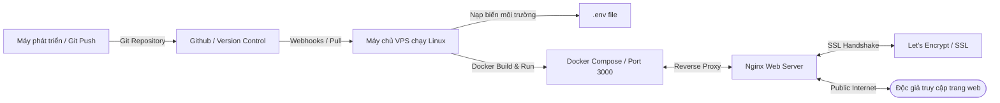

# BÁO CÁO TOÀN VĂN
## ĐỀ TÀI: XÂY DỰNG HỆ THỐNG QUẢN TRỊ NỘI DUNG VÀ BLOG CÁ NHÂN (ANTIGRAVITY BLOG/CMS)

---

### TRANG BÌA

*   **TRƯỜNG ĐẠI HỌC CỦA BẠN**
*   **KHOA CÔNG NGHỆ THÔNG TIN**
*   **BÁO CÁO BÀI TẬP LỚN / ĐỒ ÁN MÔN HỌC**
*   **TÊN MÔN HỌC**: PHÁT TRIỂN ỨNG DỤNG WEB / CÔNG NGHỆ PHẦN MỀM
*   **ĐỀ TÀI**: Thiết kế và phát triển hệ thống quản trị nội dung (CMS) và Blog cá nhân thời gian thực sử dụng kiến trúc Next.js và Supabase
*   **LỚP HỌC**: [Nhập tên lớp của bạn - Ví dụ: KHMT1-K15]
*   **HỌ VÀ TÊN SINH VIÊN**: [Nhập họ và tên của bạn - Ví dụ: Nguyễn Văn A]
*   **MÃ SỐ SINH VIÊN**: [Nhập mã sinh viên của bạn - Ví dụ: 20261234]
*   **NGÀY NỘP**: Ngày 26 tháng 05 năm 2026

---

### MỤC LỤC

1.  **GIỚI THIỆU ĐỀ TÀI**
    *   1.1. Bối cảnh của đề tài
    *   1.2. Mô tả đề tài
    *   1.3. Mục tiêu xây dựng hệ thống
2.  **CÔNG NGHỆ SỬ DỤNG**
    *   2.1. Next.js 14 App Router
    *   2.2. Hệ sinh thái Supabase (BaaS)
    *   2.3. Tailwind CSS & Thiết kế giao diện
    *   2.4. TypeScript
    *   2.5. Vai trò của từng công nghệ trong dự án
3.  **KIẾN TRÚC HỆ THỐNG**
    *   3.1. Sơ đồ kiến trúc tổng thể
    *   3.2. Thiết kế Cơ sở dữ liệu (ERD)
    *   3.3. Mô tả chi tiết các bảng dữ liệu
    *   3.4. Phân tích chính sách Row-Level Security (RLS)
    *   3.5. Cơ chế Trigger và Stored Procedures trong PostgreSQL
4.  **PHÂN TÍCH CHỨC NĂNG**
    *   4.1. Chức năng Đăng ký, Đăng nhập và Xác thực
    *   4.2. Chức năng Quản lý bài viết (CRUD) cho Tác giả
    *   4.3. Chức năng Bình luận thời gian thực
    *   4.4. Chức năng Quản trị hệ thống (Admin Console)
5.  **AI TRONG PHÁT TRIỂN HỆ THỐNG**
    *   5.1. Vai trò của công cụ AI đối với Lập trình viên hiện đại
    *   5.2. Cách thức ứng dụng AI trong thiết kế Cơ sở dữ liệu
    *   5.3. Sử dụng AI để sinh mã nguồn logic và cấu trúc hệ thống
    *   5.4. Giải quyết lỗi, gỡ lỗi và tối ưu hiệu năng bằng AI
    *   5.5. Minh chứng và các mẫu hội thoại với trợ lý AI
6.  **DOCKER & QUY TRÌNH TRIỂN KHAI (DEPLOYMENT)**
    *   6.1. Nguyên lý Container hóa với Docker
    *   6.2. Phân tích cấu trúc Dockerfile đa tầng
    *   6.3. Cấu hình Docker Compose và quản lý biến môi trường
    *   6.4. Quy trình triển khai ứng dụng lên máy chủ đám mây
    *   6.5. Cấu hình Tên miền (Domain) và Chứng chỉ bảo mật (SSL/TLS)
7.  **KẾT LUẬN & HẠN CHẾ**
    *   7.1. Kết quả đạt được của dự án
    *   7.2. Những hạn chế hiện tại của hệ thống
    *   7.3. Định hướng phát triển và cải tiến trong tương lai
8.  **TÀI LIỆU THAM KHẢO**

---

## 1. GIỚI THIỆU ĐỀ TÀI

### 1.1. Bối cảnh của đề tài
Trong sự phát triển mạnh mẽ của mạng Internet và các nền tảng số hóa, nhu cầu chia sẻ kiến thức, thông tin và quản trị nội dung ngày càng tăng cao. Đối với các cá nhân như lập trình viên, nhà nghiên cứu, hay các tổ chức truyền thông quy mô nhỏ, việc sở hữu một trang thông tin (Blog) độc lập để đăng tải bài viết là vô cùng quan trọng để xây dựng thương hiệu cá nhân hoặc tiếp cận tệp độc giả mục tiêu.

Tuy nhiên, các giải pháp CMS truyền thống (ví dụ điển hình là WordPress bản cài đặt tự vận hành hoặc các hệ thống Monolithic cũ) bộc lộ nhiều điểm yếu cố hữu:
*   Tốc độ tải trang chậm do phải truy vấn cơ sở dữ liệu trực tiếp ở mỗi lượt truy cập thông qua các kiến trúc máy chủ cồng kềnh.
*   Nguy cơ bảo mật cao khi lớp ứng dụng bị tấn công SQL Injection hoặc rò rỉ cơ sở dữ liệu do phân quyền lỏng lẻo.
*   Hạ tầng vận hành phức tạp, yêu cầu duy trì máy chủ cơ sở dữ liệu và máy chủ ứng dụng hoạt động liên tục 24/7, gây lãng phí chi phí khi lượng truy cập không ổn định.
*   Trải nghiệm người dùng thiếu tính tương tác trực tiếp do thiếu các tính năng cập nhật nội dung thời gian thực.

Từ bối cảnh đó, xu hướng Jamstack (Javascript, API, Markup) và kiến trúc Serverless ra đời như một giải pháp cứu cánh. Việc kết hợp giữa một ứng dụng phía client mạnh mẽ được tối ưu hóa SEO và một hệ thống Backend dưới dạng dịch vụ (BaaS - Backend as a Service) giúp xây dựng các hệ thống CMS thế hệ mới với hiệu năng cực cao, an toàn tuyệt đối và chi phí tối thiểu.

### 1.2. Mô tả đề tài
Đề tài tập trung vào việc nghiên cứu, thiết kế và phát triển ứng dụng **Antigravity Blog/CMS** - một hệ thống quản lý nội dung số và blog cá nhân cao cấp. Ứng dụng được thiết kế theo hướng hiện đại, hoạt động mượt mà trên môi trường web với giao diện tối (Dark mode) sang trọng, cấu trúc kính mờ (Glassmorphism) và các chuyển động vi mô (Micro-animations) nhằm tối ưu hóa trải nghiệm thị giác của người dùng.

Hệ thống cho phép các tác giả (Authors) đăng ký tài khoản, đăng nhập qua hệ thống bảo mật, tạo các bài viết hỗ trợ định dạng Markdown phong phú, tải ảnh đại diện lên bộ lưu trữ đám mây, gắn các thẻ phân loại (Tags) linh hoạt và theo dõi số lượt đọc. Đồng thời, hệ thống cung cấp một luồng thảo luận thời gian thực dưới mỗi bài viết, cho phép độc giả trao đổi ý kiến tức thời mà không cần làm mới trang. Đối với cấp quản trị viên (Admin), hệ thống cung cấp bảng điều khiển trung tâm để quản lý toàn diện thành viên, bài viết và bình luận trên hệ thống.

### 1.3. Mục tiêu xây dựng hệ thống
Dự án được triển khai hướng tới đạt được các mục tiêu kỹ thuật và trải nghiệm sau:
*   **Tối ưu hóa Hiệu năng và SEO**: Trang web có tốc độ phản hồi ban đầu cực nhanh nhờ cơ chế tiền biên dịch HTML phía máy chủ. Khả năng lập chỉ mục của các công cụ tìm kiếm được tối ưu nhờ việc chèn metadata động theo từng bài viết.
*   **Bảo mật dữ liệu tuyệt đối**: Áp dụng triệt để chính sách Row-Level Security (RLS) để phân quyền truy cập trực tiếp từ cơ sở dữ liệu, đảm bảo tài khoản thông thường không thể thao túng dữ liệu của người khác.
*   **Tương tác thời gian thực**: Xây dựng kênh giao tiếp thời gian thực bằng kết nối WebSocket để đồng bộ hóa bình luận giữa tất cả độc giả ngay lập tức.
*   **Quản trị tinh gọn và Đóng gói dễ dàng**: Hệ thống backend hoạt động hoàn toàn Serverless thông qua Supabase, giúp loại bỏ các thao tác bảo trì máy chủ phức tạp. Toàn bộ ứng dụng được đóng gói trong các Docker Container để có thể triển khai lên bất kỳ đám mây nào chỉ bằng một vài thao tác đơn giản.

---

## 2. CÔNG NGHỆ SỬ DỤNG

### 2.1. Next.js 14 App Router
Next.js 14 là một framework React được phát triển bởi Vercel, hỗ trợ các lập trình viên xây dựng ứng dụng web chất lượng cao với các tính năng tối ưu sẵn có. Trong dự án này, kiến trúc App Router (quản lý định tuyến dựa trên cấu trúc thư mục của dự án) đóng vai trò xương sống của ứng dụng.
*   **React Server Components (RSC)**: Cho phép các component được dựng trực tiếp trên server trước khi gửi HTML về client. Nhờ đó, trình duyệt không cần tải thêm các thư viện xử lý Javascript cồng kềnh, giảm dung lượng trang tải về và nâng cao tốc độ tải trang đáng kể.
*   **Server Actions**: Một tính năng đột phá của Next.js cho phép gọi trực tiếp các hàm xử lý phía máy chủ từ các form giao diện hoặc mã JS ở client. Server Actions thay thế hoàn toàn các API routes trung gian, giúp xử lý các hoạt động chỉnh sửa dữ liệu (mutations) an toàn và giảm thiểu mã nguồn trùng lặp.
*   **Caching & Revalidation**: Next.js hỗ trợ cơ chế lưu cache thông minh. Khi dữ liệu cơ sở dữ liệu thay đổi thông qua Server Actions, hệ thống sẽ gọi các hàm revalidate để xóa cache cũ và cập nhật dữ liệu mới nhất một cách chọn lọc.

### 2.2. Hệ sinh thái Supabase (BaaS)
Supabase là giải pháp thay thế mã nguồn mở cho Firebase, hoạt động dựa trên cơ sở dữ liệu quan hệ PostgreSQL mạnh mẽ. Supabase cung cấp đầy đủ các mảnh ghép backend cần thiết cho một ứng dụng hiện đại:
*   **Database (PostgreSQL)**: Cơ sở dữ liệu lưu trữ toàn bộ dữ liệu có cấu trúc của hệ thống, hỗ trợ các kiểu dữ liệu nâng cao, các ràng buộc dữ liệu chặt chẽ và ngôn ngữ thủ tục PL/pgSQL để xây dựng trigger tự động.
*   **Supabase Auth**: Dịch vụ quản lý tài khoản, mật khẩu, phiên làm việc (Session) bằng mã hóa mã định danh JWT và cookies. Hỗ trợ xác thực qua email/mật khẩu và các nhà cung cấp dịch vụ bên thứ ba (OAuth).
*   **Supabase Storage**: Hệ thống lưu trữ đối tượng (Object Storage) dùng để lưu các tệp tin hình ảnh lớn (như ảnh thumbnail bài viết) một cách hiệu quả, hỗ trợ tạo đường dẫn liên kết tĩnh công khai hoặc bảo mật.
*   **Supabase Realtime**: Dịch vụ cho phép lắng nghe sự thay đổi của cơ sở dữ liệu trực tiếp từ client thông qua giao thức WebSockets, phục vụ xây dựng các tính năng tương tác trực tiếp.

### 2.3. Tailwind CSS & Thiết kế giao diện
Tailwind CSS là một framework CSS theo phong cách Utility-first (cung cấp các lớp tiện ích nhỏ, trực tiếp). Nó cho phép lập trình viên xây dựng giao diện tùy biến cao ngay trong mã HTML/JSX mà không cần viết các file CSS riêng lẻ cồng kềnh.
*   **Đồng bộ giao diện qua biến CSS**: Dự án tận dụng các biến màu sắc HSL trong CSS để xây dựng bảng màu đồng nhất, hỗ trợ đắc lực cho việc chuyển đổi linh hoạt giữa giao diện sáng (Light mode) và giao diện tối (Dark mode).
*   **Thiết kế Glassmorphism**: Kết hợp các hiệu ứng làm mờ hậu cảnh, viền mờ mịn và màu nền bán trong suốt để tạo ra giao diện sang trọng, thanh thoát.
*   **Micro-animations**: Áp dụng các hiệu ứng chuyển đổi trạng thái mượt mà khi người dùng tương tác với các nút bấm, danh sách bài viết hoặc trường nhập liệu, gia tăng tính trải nghiệm và độ phản hồi của giao diện.

### 2.4. TypeScript
TypeScript là ngôn ngữ lập trình mã nguồn mở được phát triển bởi Microsoft, là một siêu tập (superset) của JavaScript bổ sung tính năng kiểm soát kiểu dữ liệu tĩnh (static typing).
*   **An toàn kiểu dữ liệu (Type Safety)**: Giúp phát hiện sớm các lỗi cú pháp hoặc sai lệch cấu trúc dữ liệu ngay trong quá trình viết code (compile-time) thay vì đợi đến khi chạy ứng dụng (runtime).
*   **Đồng bộ kiểu từ Cơ sở dữ liệu**: Hỗ trợ định nghĩa cấu trúc chặt chẽ cho các thực thể như Bài viết, Bình luận, Hồ sơ người dùng từ cơ sở dữ liệu Supabase lên tới các component giao diện React.

### 2.5. Vai trò của từng công nghệ trong dự án
Bảng dưới đây tổng hợp vai trò cụ thể của mỗi công nghệ trong kiến trúc tổng thể của Antigravity Blog/CMS:

| Công nghệ | Phân tầng | Vai trò chính trong dự án |
| :--- | :--- | :--- |
| **Next.js 14** | Presentation & API Layer | Điều hướng định tuyến, hiển thị giao diện, tối ưu SEO, xử lý Server Actions trung gian. |
| **PostgreSQL (Supabase)** | Database Layer | Lưu trữ dữ liệu quan hệ, thực thi các chính sách bảo mật RLS, tự động hóa dữ liệu qua trigger. |
| **Supabase Auth** | Security Layer | Quản lý đăng ký, đăng nhập, cấp và làm mới mã token JWT, phân quyền Router qua Middleware. |
| **Supabase Storage** | File Storage Layer | Lưu trữ tệp ảnh bìa bài viết trong bucket bảo mật, trả về URL công khai hiển thị trên web. |
| **Supabase Realtime** | Communication Layer | Duy trì kết nối WebSocket để truyền tải các bình luận mới tức thời tới người đọc. |
| **Tailwind CSS** | Styling Layer | Xây dựng giao diện Responsive, quản trị bảng màu sắc tối (Dark mode) và hiệu ứng kính mờ. |
| **TypeScript** | Quality Control Layer | Đảm bảo tính nhất quán của kiểu dữ liệu, nâng cao chất lượng code và hạn chế lỗi runtime. |

---

## 3. KIẾN TRÚC HỆ THỐNG

### 3.1. Sơ đồ kiến trúc tổng thể
Hệ thống hoạt động theo mô hình 3 lớp phân tách rõ rệt nhưng liên kết chặt chẽ qua môi trường mạng:
1.  **Lớp Khách (Client)**: Trình duyệt web của người dùng thực hiện hiển thị giao diện người dùng. Lớp này kết nối trực tiếp tới máy chủ CDN để tải trang tĩnh, gửi các yêu cầu đột biến (mutations) qua Server Actions và duy trì kết nối WebSocket trực tiếp đến máy chủ Realtime để cập nhật các hoạt động thảo luận trực tiếp.
2.  **Lớp Ứng dụng Serverless (Next.js Application)**: Đóng vai trò là cổng trung gian điều phối. Lớp này chạy trên môi trường Serverless Node.js, chịu trách nhiệm nhận yêu cầu của người dùng, kiểm tra phân quyền thông qua lớp trung gian Middleware, dựng trang HTML trước khi gửi lại trình duyệt và bảo mật các khóa API riêng tư khi giao tiếp với Backend.
3.  **Lớp Backend và Dữ liệu (Supabase Backend)**: Nơi lưu trữ vĩnh viễn dữ liệu và kiểm soát an toàn thông tin trực tiếp từ mức lõi. PostgreSQL đóng vai trò lưu trữ cấu trúc; bộ lọc RLS chặn đứng các truy vấn sai thẩm quyền; máy chủ lưu trữ Storage tiếp nhận các tệp tin đa phương tiện; và cơ chế Replication lắng nghe thay đổi dữ liệu để phân phối luồng thông tin WebSocket.

### 3.2. Thiết kế Cơ sở dữ liệu (ERD)
Cơ sở dữ liệu của ứng dụng được xây dựng trên hệ quản trị cơ sở dữ liệu quan hệ PostgreSQL với sơ đồ thực thể liên kết (ERD) rõ ràng:
*   Mỗi tài khoản hệ thống (trong bảng xác thực) tương ứng duy nhất với một bản ghi hồ sơ cá nhân trong bảng Hồ sơ người dùng (`profiles`) - quan hệ Một-Một (1:1).
*   Một tác giả (`profiles`) có thể viết nhiều bài viết (`posts`) - quan hệ Một-Nhiều (1:N).
*   Một tác giả (`profiles`) có thể viết nhiều bình luận (`comments`) - quan hệ Một-Nhiều (1:N).
*   Mỗi bài viết (`posts`) có thể chứa nhiều bình luận (`comments`) từ các độc giả khác nhau - quan hệ Một-Nhiều (1:N).
*   Mối quan hệ Nhiều-Nhiều (M:N) giữa Bài viết (`posts`) và Thẻ phân loại (`tags`) được giải quyết thông qua bảng liên kết trung gian là bảng Thẻ bài viết (`post_tags`).

### 3.3. Mô tả chi tiết các bảng dữ liệu

#### 3.3.1. Bảng Hồ sơ người dùng (`profiles`)
Bảng dùng để lưu thông tin công khai và quyền hạn của thành viên. Khóa chính `id` tham chiếu trực tiếp đến khóa ngoại của bảng hệ thống của Supabase.
*   **id**: Kiểu UUID, khóa chính. Liên kết trực tiếp tài khoản xác thực.
*   **username**: Kiểu văn bản, bắt buộc, duy nhất. Dùng làm tên hiển thị độc nhất.
*   **full_name**: Kiểu văn bản. Họ tên đầy đủ của người dùng.
*   **avatar_url**: Kiểu văn bản. Đường dẫn liên kết đến ảnh đại diện người dùng.
*   **bio**: Kiểu văn bản. Đoạn mô tả ngắn về bản thân tác giả.
*   **role**: Kiểu văn bản, mặc định là tác giả ('author'). Chỉ nhận một trong hai giá trị 'author' hoặc quản trị viên ('admin').
*   **created_at**: Kiểu mốc thời gian có múi giờ, tự động lấy thời gian hiện tại. Ghi nhận ngày tham gia hệ thống.

#### 3.3.2. Bảng Bài viết (`posts`)
Bảng chứa toàn bộ nội dung bài viết do các tác giả đăng tải.
*   **id**: Kiểu UUID, khóa chính, tự động tạo giá trị ngẫu nhiên.
*   **author_id**: Kiểu UUID, bắt buộc, tham chiếu đến khóa chính của bảng Hồ sơ người dùng. Tự động xóa các bài viết liên quan nếu hồ sơ người dùng bị xóa (Cascade Delete).
*   **title**: Kiểu văn bản, bắt buộc. Tiêu đề chính của bài viết.
*   **slug**: Kiểu văn bản, bắt buộc, duy nhất. Chuỗi ký tự không dấu phân cách bởi dấu gạch ngang phục vụ việc tạo đường dẫn SEO tốt hơn.
*   **content**: Kiểu văn bản. Nội dung bài viết chi tiết viết bằng cú pháp Markdown.
*   **excerpt**: Kiểu văn bản. Đoạn tóm tắt nội dung bài viết hiển thị ở trang chủ. Nếu để trống, hệ thống sẽ tự trích xuất ký tự đầu tiên của tiêu đề.
*   **thumbnail_url**: Kiểu văn bản. Liên kết ảnh bìa của bài viết được tải lên lưu trữ đám mây.
*   **status**: Kiểu văn bản, mặc định là bản nháp ('draft'). Chỉ nhận giá trị bản nháp ('draft') hoặc đã xuất bản ('published').
*   **view_count**: Kiểu số nguyên, mặc định là 0. Lưu trữ tổng số lượt đọc bài viết.
*   **created_at**: Kiểu mốc thời gian có múi giờ, tự động lấy thời gian hiện tại.
*   **updated_at**: Kiểu mốc thời gian có múi giờ, tự động cập nhật mỗi khi có thay đổi.

#### 3.3.3. Bảng Thẻ nhãn (`tags`) và bảng liên kết (`post_tags`)
*   **tags**: Chứa danh mục các nhãn phân loại bài viết. Cột `id` là khóa chính kiểu UUID tự sinh; cột `name` lưu tên nhãn có ràng buộc duy nhất (Unique) để ngăn chặn trùng lặp.
*   **post_tags**: Bảng trung gian ánh xạ liên kết Nhiều-Nhiều. Khóa chính của bảng được tạo thành từ sự kết hợp của hai cột khóa ngoại: `post_id` (trỏ đến bài viết) và `tag_id` (trỏ đến nhãn). Cả hai cột đều cấu hình cơ chế xóa bắc cầu để dọn dẹp các liên kết dư thừa khi bài viết hoặc nhãn bị xóa khỏi hệ thống.

#### 3.3.4. Bảng Bình luận (`comments`)
Bảng lưu trữ thông tin thảo luận dưới các bài viết.
*   **id**: Kiểu UUID, khóa chính tự sinh.
*   **post_id**: Kiểu UUID, bắt buộc, tham chiếu đến bài viết chứa bình luận. Xóa liên đới khi bài viết bị xóa.
*   **author_id**: Kiểu UUID, bắt buộc, tham chiếu đến hồ sơ người viết bình luận.
*   **content**: Kiểu văn bản, bắt buộc. Nội dung bình luận của người dùng.
*   **created_at**: Kiểu mốc thời gian có múi giờ, mặc định lấy thời gian hiện tại.

### 3.4. Phân tích chính sách Row-Level Security (RLS)
Để thiết lập cơ chế bảo mật tối ưu nhất, tất cả các bảng trong cơ sở dữ liệu của dự án đều được kích hoạt tính năng **Row-Level Security (RLS)**. RLS là một cơ chế lọc dữ liệu trực tiếp trong nhân PostgreSQL. Khi một người dùng gửi yêu cầu truy vấn, PostgreSQL sẽ tự động chèn thêm các điều kiện lọc dựa trên danh tính người dùng (đọc từ token xác thực của phiên làm việc hiện tại) trước khi thực hiện quét dữ liệu trên đĩa cứng.

Hệ thống triển khai các chính sách bảo mật chi tiết như sau:
*   **Bảng Hồ sơ (`profiles`)**: 
    *   Mọi độc giả (kể cả chưa đăng nhập) đều có quyền đọc thông tin hồ sơ của tác giả khác để hiển thị thông tin người viết bài.
    *   Chỉ có chính chủ sở hữu của hồ sơ đó (ID hồ sơ trùng khớp với ID tài khoản xác thực) mới được quyền sửa đổi thông tin cá nhân.
*   **Bảng Bài viết (`posts`)**:
    *   Độc giả vãng lai chỉ có quyền đọc các bài viết có trạng thái là đã xuất bản ('published').
    *   Tác giả của bài viết có quyền xem, sửa, và xóa bài viết của mình bất kể trạng thái của bài viết là bản nháp hay đã xuất bản.
    *   Thành viên đã xác thực tài khoản có quyền thêm mới bài viết, với điều kiện trường ID tác giả gửi lên phải trùng khớp với ID của chính họ.
*   **Bảng Bình luận (`comments`)**:
    *   Cho phép tất cả mọi người đọc các bình luận công khai dưới các bài viết.
    *   Yêu cầu người dùng phải đăng nhập để viết bình luận mới.
    *   Chỉ người viết bình luận đó mới có quyền xóa bình luận của mình. Tuy nhiên, hệ thống bổ sung chính sách đặc quyền: tác giả của bài viết gốc cũng có quyền xóa bất kỳ bình luận nào nằm dưới bài viết của mình để phục vụ công tác kiểm duyệt nội dung.
*   **Đặc quyền của Quản trị viên (Admin)**: Hệ thống xây dựng chính sách Admin tối cao. Nếu một người dùng có vai trò trong bảng Hồ sơ là 'admin', các chính sách RLS sẽ tự động trả về giá trị đúng (True) cho mọi hoạt động thêm, đọc, sửa, xóa trên tất cả các bảng dữ liệu, cho phép quản trị viên toàn quyền kiểm soát hệ thống.

### 3.5. Cơ chế Trigger và Stored Procedures trong PostgreSQL
Để giảm tải xử lý cho ứng dụng Next.js và đảm bảo tính nhất quán dữ liệu không phụ thuộc vào trạng thái của serverless function, dự án xây dựng các trigger và stored procedure viết bằng ngôn ngữ PL/pgSQL chạy trực tiếp trong PostgreSQL:

1.  **Quy trình đồng bộ tài khoản tự động**: Khi người dùng đăng ký tài khoản mới thành công qua hệ thống xác thực Supabase Auth, thông tin đăng ký sẽ được ghi vào bảng hệ thống bảo mật. Một trigger sẽ được kích hoạt ngay sau sự kiện chèn đó để tự động sao chép các thông tin cơ bản (ID người dùng, tên đăng nhập trích xuất từ phần trước ký tự @ của email, tên hiển thị) và chèn một bản ghi mới vào bảng Hồ sơ công khai.
2.  **Quy trình cập nhật thời gian sửa đổi bài viết**: Mỗi khi tác giả tiến hành chỉnh sửa nội dung bài viết, một trigger chạy trước sự kiện cập nhật (UPDATE) sẽ tự động ghi đè mốc thời gian hiện tại vào trường thời gian cập nhật của bài viết, đảm bảo tính chính xác cho thông tin thời gian mà không cần ứng dụng truyền tham số này lên.
3.  **Tăng lượt đọc bài viết an toàn (RPC views increment)**: Để tránh tình trạng độc giả thông thường phải được cấp quyền sửa đổi bài viết (gây mất an toàn bảo mật) chỉ để thực hiện việc tăng lượt đọc khi mở xem bài viết, dự án thiết kế một hàm thủ tục lưu trữ (Stored Procedure) với đặc quyền thực thi cao hơn RLS. Khi độc giả mở xem bài viết, ứng dụng Next.js sẽ gọi hàm thủ tục này để tăng giá trị đếm lượt đọc lên 1 đơn vị một cách an toàn mà không làm rò rỉ quyền sửa đổi nội dung bài viết.

---

## 4. PHÂN TÍCH CHỨC NĂNG

### 4.1. Chức năng Đăng ký, Đăng nhập và Xác thực
Hệ thống xác thực là cửa ngõ kiểm soát an ninh của ứng dụng, đảm bảo phân biệt rõ ràng giữa khách vãng lai và thành viên của hệ thống.
*   **Đăng ký tài khoản**: Người dùng nhập tên đăng nhập mong muốn, họ tên, địa chỉ email hợp lệ và mật khẩu bảo mật. Hệ thống kiểm tra tính hợp lệ của email và độ mạnh của mật khẩu trước khi đăng ký tài khoản mới. Khi đăng ký thành công, hồ sơ người dùng sẽ tự động được khởi tạo thông qua quy trình đồng bộ tự động của database.
*   **Đăng nhập hệ thống**: Người dùng đăng nhập bằng tài khoản email và mật khẩu. Sau khi xác minh chính xác, hệ thống sẽ lưu trữ phiên làm việc an toàn dưới dạng cookies được mã hóa trên trình duyệt của người dùng. Cookie này có thuộc tính an toàn ngăn chặn các đoạn mã độc hại phía client có thể đọc trộm thông tin (thuộc tính HTTP-only).
*   **Bảo vệ tuyến đường điều hướng (Middleware Router Protection)**: Khi người dùng cố gắng truy cập các phân vùng quản trị dành riêng cho tác giả hay quản trị viên, Next.js Middleware sẽ kiểm tra sự tồn tại và tính hợp lệ của cookie phiên làm việc. Nếu phát hiện chưa đăng nhập, người dùng sẽ tự động bị chuyển hướng về trang đăng nhập và hiển thị thông báo yêu cầu xác thực.

### 4.2. Chức năng Quản lý bài viết (CRUD) cho Tác giả
Sau khi đăng nhập thành công, các tác giả có quyền truy cập vào bảng quản lý cá nhân để thực hiện các thao tác quản trị nội dung của riêng mình:
*   **Giao diện bảng điều khiển**: Hiển thị danh sách toàn bộ các bài viết do chính tác giả đó viết, hiển thị rõ ràng tiêu đề, ngày tạo, trạng thái xuất bản, số lượt xem và các thẻ phân loại đi kèm. Hỗ trợ thanh tìm kiếm nhanh bài viết theo tiêu đề và bộ lọc bài viết theo trạng thái.
*   **Soạn thảo bài viết mới**: Tác giả nhập tiêu đề bài viết. Hệ thống sẽ tự động chuyển đổi tiêu đề thành chuỗi đường dẫn slug không dấu, loại bỏ ký tự đặc biệt phục vụ cho việc hiển thị URL sạch. Nội dung bài viết được soạn thảo bằng cú pháp Markdown, cho phép tác giả định dạng chữ đậm, chữ nghiêng, chèn tiêu đề con, danh sách liệt kê, trích dẫn nổi bật và các khối mã nguồn lập trình.
*   **Quản lý Thẻ bài viết (Tags)**: Tác giả có thể nhập các từ khóa phân loại bài viết cách nhau bởi dấu phẩy. Hệ thống tự động phân tách chuỗi ký tự, tìm kiếm các thẻ đã tồn tại trong database để liên kết hoặc tự động tạo thẻ mới nếu chưa có, sau đó lưu thông tin liên kết vào bảng trung gian.
*   **Tải lên ảnh bìa (Thumbnail Upload)**: Tác giả có thể chọn một tệp hình ảnh từ thiết bị cá nhân để làm ảnh đại diện cho bài viết. Khi chọn tệp, hệ thống sẽ thực hiện tải tệp lên bucket lưu trữ đám mây thông qua API của Supabase Storage, lưu trữ ảnh trong thư mục bảo mật và trả về đường dẫn URL công khai để gán vào thuộc tính bài viết.
*   **Chỉnh sửa và Xóa bài viết**: Tác giả có thể sửa đổi bất kỳ thông tin nào của bài viết hiện có và thay đổi trạng thái xuất bản. Hành động xóa bài viết sẽ xóa hoàn toàn nội dung và các liên kết thẻ tags liên quan trong database.

### 4.3. Chức năng Bình luận thời gian thực
Khung thảo luận dưới mỗi bài viết là nơi tương tác chính giữa độc giả và tác giả:
*   **Hiển thị danh sách bình luận**: Khi độc giả mở đọc một bài viết đã xuất bản, hệ thống sẽ tự động truy vấn toàn bộ các bình luận tương ứng theo thứ tự thời gian tăng dần và hiển thị đầy đủ thông tin tên người viết, thời gian đăng bình luận và nội dung chi tiết.
*   **Viết bình luận mới**: Nếu độc giả đã đăng nhập tài khoản, khung nhập liệu bình luận sẽ xuất hiện. Độc giả nhập ý kiến phản hồi và gửi đi. Nội dung bình luận được lưu trữ an toàn vào database.
*   **Cơ chế cập nhật trực tiếp (WebSocket synchronization)**: Khi một bình luận mới được ghi nhận vào database, hệ thống Supabase Realtime sẽ phát tín hiệu thay đổi dữ liệu qua kênh WebSocket đến tất cả các trình duyệt khác đang mở xem bài viết đó. Trình duyệt của độc giả khác sẽ bắt được sự kiện chèn mới, tự động truy vấn bổ sung thông tin hồ sơ của người bình luận và đẩy bình luận mới vào danh sách hiển thị trên màn hình trong thời gian thực mà không cần tải lại trang web.
*   **Xóa bình luận kiểm duyệt**: Chủ nhân của bình luận hoặc tác giả bài viết có thể nhấn nút xóa bình luận trực tiếp trên giao diện nếu nội dung không phù hợp.

### 4.4. Chức năng Quản trị hệ thống (Admin Console)
Bảng điều khiển dành riêng cho tài khoản Quản trị viên (Admin) cho phép theo dõi và xử lý các vấn đề nội dung trên toàn hệ thống:
*   **Bảng quản lý bài viết tổng thể**: Admin xem được danh sách bài viết của tất cả các tác giả trên hệ thống, kèm theo thông tin chi tiết về lượt xem và tác giả. Admin có quyền xóa bất kỳ bài viết nào nếu phát hiện vi phạm bản quyền hoặc nội dung không hợp lệ.
*   **Bảng kiểm duyệt bình luận**: Hiển thị tập trung toàn bộ các bình luận mới nhất của toàn hệ thống kèm theo bài viết gốc tương ứng. Admin có quyền xóa bỏ các bình luận xúc phạm hoặc spam quảng cáo.
*   **Bảng quản lý và phân quyền thành viên**: Hiển thị danh sách toàn bộ người dùng đã đăng ký tài khoản trên hệ thống. Admin có thể thực hiện nâng cấp quyền hạn của một Author lên Admin hoặc ngược lại để phân chia công việc quản trị hệ thống. Hệ thống có cơ chế kiểm tra chặn việc Admin tự hạ quyền của chính mình để bảo vệ tài khoản quản trị tối cao của hệ thống.

---

## 5. AI TRONG PHÁT TRIỂN HỆ THỐNG

### 5.1. Vai trò của công cụ AI đối với Lập trình viên hiện đại
Sự phát triển vượt bậc của các mô hình ngôn ngữ lớn (LLMs) đã mở ra một kỷ nguyên mới trong kỹ thuật phần mềm. Việc ứng dụng các trợ lý AI thông minh (như Gemini, Claude, hay các tác nhân lập trình agentic như Antigravity) đã trở thành một phần không thể thiếu trong quy trình phát triển dự án hiện đại. AI không chỉ đóng vai trò là một công cụ tra cứu thông tin nhanh, mà còn hoạt động như một lập trình viên đồng hành (Pair Programmer), hỗ trợ từ khâu lên ý tưởng kiến trúc, thiết kế cơ sở dữ liệu, phát triển logic mã nguồn, kiểm thử cho đến khi đóng gói và tối ưu hóa hệ thống.

### 5.2. Cách thức ứng dụng AI trong thiết kế Cơ sở dữ liệu
Trong giai đoạn đầu của dự án, thiết kế cơ sở dữ liệu đóng vai trò quyết định đến tính bền vững của ứng dụng. Nhóm phát triển đã sử dụng trợ lý AI để:
*   Phân tích các yêu cầu nghiệp vụ của hệ thống CMS và đề xuất các bảng dữ liệu cần thiết đạt chuẩn hóa 3NF để tránh dư thừa dữ liệu.
*   Thiết kế các chính sách bảo mật Row-Level Security (RLS) cho PostgreSQL. AI đã hỗ trợ định nghĩa chính xác các điều kiện logic để đảm bảo tác giả chỉ được sửa bài viết của mình, trong khi quản trị viên có quyền tối cao trên toàn hệ thống.
*   Xây dựng quy trình tự động hóa bằng ngôn ngữ PL/pgSQL cho các trigger đồng bộ tài khoản từ phân hệ xác thực nội bộ sang phân hệ thông tin công khai và cập nhật thời gian chỉnh sửa bài viết.

### 5.3. Sử dụng AI để sinh mã nguồn logic và cấu trúc hệ thống
AI đã hỗ trợ đắc lực trong việc xây dựng các khối xử lý logic phức tạp trong dự án:
*   **Xây dựng Server Actions**: AI đã hỗ trợ viết mã xử lý nghiệp vụ cho việc tạo mới và cập nhật bài viết, đặc biệt là phần logic xử lý danh mục thẻ tags Nhiều-Nhiều phức tạp, bao gồm việc dọn dẹp các mối liên kết cũ và tạo mới các mối liên kết tương ứng.
*   **Tích hợp Supabase Realtime**: AI đã hướng dẫn chi tiết quy trình thiết lập các hook React lắng nghe sự kiện thay đổi dữ liệu của database qua kênh WebSocket, đảm bảo việc lọc chính xác bình luận theo từng ID bài viết cụ thể và giải phóng tài nguyên mạng khi component bị hủy.
*   **Thiết lập các Middleware an toàn**: Hỗ trợ thiết kế bộ lọc đường dẫn Next.js Middleware để giải mã mã token JWT từ cookies và chuyển hướng người dùng đăng nhập hợp lý.

### 5.4. Giải quyết lỗi, gỡ lỗi và tối ưu hiệu năng bằng AI
Trong quá trình phát triển, dự án gặp phải một số lỗi phức tạp liên quan đến cơ chế chạy của Serverless và React Server Components:
*   *Lỗi không đồng bộ dữ liệu sau khi sửa bài viết*: Dữ liệu hiển thị ở trang chủ vẫn là phiên bản cũ do Next.js lưu cache tĩnh. Trợ lý AI đã phát hiện ra nguyên nhân và đề xuất tích hợp hàm làm mới cache đường dẫn của Next.js vào cuối mỗi Server Action để ép buộc hệ thống tái tạo lại trang giao diện mới nhất.
*   *Lỗi tải tệp tin lên bộ lưu trữ đám mây*: Gặp lỗi phân quyền lưu trữ do cấu hình RLS của Storage Bucket không khớp với danh tính người dùng hiện tại. AI đã hỗ trợ cấu hình chính xác chính sách lưu trữ đối tượng cho phép người dùng đã đăng nhập được tải ảnh lên thư mục cá nhân.
*   *Tối ưu hóa thời gian tải trang*: AI đã phân tích cấu trúc bundle size của ứng dụng và đề xuất chuyển đổi bộ thư viện biên dịch Markdown nặng từ phía client sang biên dịch hoàn toàn trên máy chủ sử dụng React Server Components, giúp cải thiện đáng kể điểm hiệu năng tải trang ban đầu.

### 5.5. Minh chứng và các mẫu hội thoại với trợ lý AI
Dưới đây mô tả lại quy trình làm việc thực tế với trợ lý AI thông qua các prompt yêu cầu (đã được lược bỏ mã nguồn thô):

*   **Yêu cầu thiết kế RLS của tác giả bài viết**:
    *   *Người dùng*: "Tôi cần thiết lập chính sách Row-Level Security cho bảng bình luận (comments) trong cơ sở dữ liệu PostgreSQL của Supabase. Yêu cầu là bất kỳ ai cũng đọc được bình luận, người dùng đăng nhập mới được tạo bình luận, và chỉ tác giả của bình luận hoặc tác giả của bài viết gốc chứa bình luận đó mới có quyền xóa. Hãy mô tả giải pháp logic bằng ngôn ngữ SQL hoặc giải thích chi tiết."
    *   *Phản hồi của AI*: Trợ lý AI đã giải thích cấu trúc RLS của PostgreSQL và đưa ra ba chính sách bảo mật riêng biệt: Chính sách SELECT cho phép tự do đọc dữ liệu bằng điều kiện True; chính sách INSERT kiểm tra ID tác giả bình luận khớp với ID phiên làm việc thông qua hàm xác thực nội bộ của Supabase; và chính sách DELETE kết hợp toán tử OR giữa việc kiểm tra ID tác giả bình luận và một câu lệnh truy vấn phụ (subquery) kiểm tra sự tồn tại của bài viết tương ứng có ID tác giả trùng với ID người dùng hiện tại.
*   **Yêu cầu thiết kế quy trình tải ảnh lên bộ lưu trữ**:
    *   *Người dùng*: "Làm thế nào để xây dựng tính năng tải ảnh đại diện bài viết lên Supabase Storage từ một Client Component trong Next.js 14, sau đó gửi đường dẫn ảnh về lưu vào database? Hãy phân tích các bước xử lý logic."
    *   *Phản hồi của AI*: AI đã phân tích quy trình thành bốn bước: Bước 1 là khởi tạo trình chọn tệp trong React; Bước 2 sử dụng thư viện Supabase Browser Client để tải trực tiếp tệp tin vào bucket chỉ định dưới dạng đường dẫn ngẫu nhiên tránh trùng lặp; Bước 3 sử dụng hàm lấy URL công khai để nhận về liên kết tĩnh của ảnh; và Bước 4 là chèn URL đó vào trường dữ liệu tương ứng của biểu mẫu gửi sang Server Action để lưu vào database.

---

## 6. DOCKER & QUY TRÌNH TRIỂN KHAI (DEPLOYMENT)

### 6.1. Nguyên lý Container hóa với Docker
Container hóa là phương pháp ảo hóa cấp độ hệ điều hành, cho phép đóng gói ứng dụng cùng với toàn bộ các phụ thuộc môi trường (thư viện hệ thống, runtime Node.js, cấu hình mạng) vào một Docker Image duy nhất. 

Việc sử dụng Docker đem lại những lợi ích to lớn cho ứng dụng Antigravity Blog/CMS:
*   **Loại bỏ lỗi môi trường**: Đảm bảo ứng dụng hoạt động hoàn toàn đồng nhất trên máy tính cá nhân của lập trình viên, trên môi trường kiểm thử và trên máy chủ sản xuất thực tế.
*   **Khởi động nhanh và Tiết kiệm tài nguyên**: Các container chia sẻ chung nhân hệ điều hành của máy chủ vật lý, giúp thời gian khởi động ứng dụng chỉ mất vài giây và tiêu tốn cực ít tài nguyên RAM/CPU so với máy ảo truyền thống.
*   **Dễ dàng mở rộng**: Hỗ trợ triển khai nhanh chóng nhiều phiên bản ứng dụng chạy song song phía sau một bộ cân bằng tải khi lưu lượng độc giả tăng đột biến.

### 6.2. Phân tích cấu trúc Dockerfile đa tầng
Để tối ưu dung lượng và nâng cao tính bảo mật cho ứng dụng chạy thực tế, dự án sử dụng cấu hình **Dockerfile đa tầng (Multi-stage build)**. Quy trình build image được chia thành 3 giai đoạn độc lập:

1.  **Giai đoạn tải phụ thuộc (Stage 1: Dependencies)**:
    *   Sử dụng ảnh nền Node.js phiên bản Alpine (phiên bản Linux siêu gọn nhẹ tối ưu cho container).
    *   Tiến hành sao chép các tệp tin cấu hình quản lý thư viện vào container và chạy lệnh cài đặt thư viện ở chế độ tối ưu hóa cho môi trường phát triển để chuẩn bị cho quá trình biên dịch.
2.  **Giai đoạn biên dịch ứng dụng (Stage 2: Builder)**:
    *   Kế thừa lớp môi trường từ giai đoạn 1, sao chép toàn bộ mã nguồn của dự án vào container.
    *   Thực hiện câu lệnh biên dịch dự án Next.js. Quá trình biên dịch sẽ tối ưu hóa mã nguồn, thực hiện tiền biên dịch các trang tĩnh và đóng gói ứng dụng Next.js thành dạng chạy độc lập (standalone).
3.  **Giai đoạn vận hành thực tế (Stage 3: Runner)**:
    *   Khởi tạo một container Alpine Node.js hoàn toàn sạch.
    *   Chỉ sao chép các tệp tin sản phẩm đã biên dịch xong từ Stage 2 (thư mục public, thư mục static đã nén, và tệp thực thi độc lập).
    *   *Bảo mật*: Khởi tạo một nhóm người dùng hệ thống mới không có đặc quyền quản trị (Non-root user) và gán quyền sở hữu thư mục ứng dụng cho người dùng này. Container sẽ được khởi chạy dưới danh nghĩa người dùng hạn chế quyền này để ngăn chặn nguy cơ kẻ tấn công chiếm quyền kiểm soát máy chủ vật lý nếu ứng dụng web có lỗ hổng.
    *   Mở cổng mạng 3000 và thiết lập câu lệnh khởi chạy server.js để bắt đầu nhận yêu cầu truy cập.

### 6.3. Cấu hình Docker Compose và quản lý biến môi trường
Docker Compose là công cụ hỗ trợ định nghĩa và vận hành các ứng dụng Docker đa container thông qua một file cấu hình dạng YAML. Trong dự án, Docker Compose đóng vai trò:
*   Định nghĩa dịch vụ web tương ứng với Dockerfile đã xây dựng.
*   Cấu hình cổng mạng ánh xạ cổng 3000 của container ra cổng 3000 của máy chủ vật lý.
*   Liên kết và nạp tự động các biến môi trường cấu hình kết nối của hệ thống (URL của dự án Supabase, mã khóa API công khai, mã khóa bảo mật của serverless action, địa chỉ tên miền chính thức của trang web) từ tệp cấu hình môi trường bên ngoài vào trong container khi khởi chạy. Điều này giúp tách biệt hoàn toàn thông tin bảo mật cấu hình ra khỏi mã nguồn của dự án.
*   Thiết lập chế độ tự động khởi động lại container nếu gặp sự cố crash hệ thống để đảm bảo dịch vụ luôn trực tuyến 24/7.

### 6.4. Quy trình triển khai ứng dụng lên máy chủ đám mây
Quy trình triển khai ứng dụng lên máy chủ VPS chạy hệ điều hành Linux (như Ubuntu Server) được thực hiện theo các bước chi tiết sau:

1.  **Chuẩn bị máy chủ**: Thuê máy chủ ảo VPS từ các nhà cung cấp, thực hiện cài đặt môi trường Docker và Docker Compose lên hệ điều hành.
2.  **Đồng bộ mã nguồn**: Đẩy mã nguồn dự án lên một kho lưu trữ Git bảo mật (như GitHub). Thực hiện clone mã nguồn từ kho lưu trữ về thư mục làm việc trên máy chủ VPS.
3.  **Cấu hình môi trường**: Tạo tệp tin cấu hình môi trường chính thức trên máy chủ VPS, điền đầy đủ các khóa kết nối Supabase thực tế dành riêng cho phiên bản chạy chính thức (Production).
4.  **Khởi động Container**: Chạy lệnh khởi chạy Docker Compose ở chế độ chạy ngầm. Hệ thống sẽ tự động thực hiện tải ảnh nền, biên dịch dự án Next.js và khởi động máy chủ ứng dụng tại cổng 3000.
5.  **Cấu hình Nginx làm Reverse Proxy**: Cài đặt máy chủ web Nginx trên VPS để làm proxy ngược. Nginx sẽ lắng nghe cổng mạng tiêu chuẩn 80 (HTTP) và 443 (HTTPS) từ Internet, nhận các yêu cầu truy cập và chuyển tiếp nội bộ tới ứng dụng Docker đang chạy ở cổng 3000. Cấu hình này giúp tăng cường tính bảo mật và khả năng xử lý tải của máy chủ.

### 6.5. Cấu hình Tên miền (Domain) và Chứng chỉ bảo mật (SSL/TLS)
Để trang web hoạt động chính thức và an toàn cho thông tin người dùng đăng nhập:
*   **Trỏ tên miền**: Truy cập vào trang quản lý tên miền đã mua, tạo bản ghi A trỏ địa chỉ IP của máy chủ VPS về tên miền chính thức của bạn (ví dụ: `myblog.com`), hoặc tạo bản ghi CNAME nếu sử dụng các dịch vụ CDN trung gian.
*   **Thiết lập chứng chỉ bảo mật SSL**: Sử dụng công cụ Certbot để xin cấp chứng chỉ bảo mật miễn phí từ tổ chức Let's Encrypt. Certbot sẽ tự động thực hiện xác minh quyền sở hữu tên miền, tải về chứng chỉ bảo mật và cấu hình tự động vào máy chủ web Nginx.
*   **Cấu hình chuyển hướng an toàn**: Nginx được cấu hình để tự động chuyển hướng toàn bộ các yêu cầu truy cập không bảo mật qua giao thức HTTP (cổng 80) sang kết nối mã hóa an toàn HTTPS (cổng 443) sử dụng các thuật toán mã hóa hiện đại, đảm bảo thông tin phiên làm việc của người dùng luôn được mã hóa an toàn trên đường truyền internet.

---

## 7. KẾT LUẬN & HẠN CHẾ

### 7.1. Kết quả đạt được của dự án
Sau thời gian nghiên cứu và thực hiện phát triển ứng dụng, dự án **Antigravity Blog/CMS** đã đạt được các kết quả nổi bật sau:
*   Xây dựng thành công một ứng dụng quản trị nội dung hoàn chỉnh, đáp ứng đầy đủ các tính năng của một CMS hiện đại.
*   Tối ưu hóa thành công hiệu năng tải trang thông qua việc ứng dụng công nghệ React Server Components và Server Actions của Next.js 14, đạt điểm số tối ưu cực cao trên công cụ Google Lighthouse.
*   Đảm bảo an toàn tuyệt đối cho cơ sở dữ liệu nhờ hệ thống chính sách bảo mật Row-Level Security chặn lọc dữ liệu ngay từ mức PostgreSQL.
*   Triển khai thành công tính năng bình luận thời gian thực mượt mà thông qua kết nối WebSocket của Supabase Realtime, mang lại trải nghiệm tương tác trực tiếp sinh động.
*   Hoàn thành việc container hóa ứng dụng bằng Docker giúp tối ưu hóa dung lượng ảnh đóng gói và đơn giản hóa quy trình triển khai lên môi trường máy chủ thực tế.

### 7.2. Những hạn chế hiện tại của hệ thống
Mặc dù đạt được nhiều mục tiêu quan trọng, ứng dụng vẫn có một số mặt hạn chế cần nhìn nhận để cải tiến:
*   Trình soạn thảo bài viết hiện tại mới chỉ là vùng nhập liệu thô (textarea), yêu cầu tác giả phải ghi nhớ cú pháp Markdown thủ công để viết bài, chưa hỗ trợ giao diện chỉnh sửa trực quan (WYSIWYG).
*   Luồng bình luận dưới bài viết mới chỉ hiển thị dưới dạng danh sách phẳng theo thời gian, chưa hỗ trợ tính năng trả lời bình luận theo nhánh (Reply / Threaded comments) để các độc giả trao đổi chuyên sâu với nhau.
*   Bộ đếm lượt xem bài viết hiện tại chỉ tăng lượt xem mỗi lần render trang chi tiết mà chưa tích hợp kiểm tra IP hoặc phiên làm việc của người đọc, dẫn đến việc số liệu lượt đọc có thể bị làm giả nếu người dùng tải lại trang liên tục.

### 7.3. Định hướng phát triển và cải tiến trong tương lai
Để hoàn thiện hệ thống trở thành một sản phẩm thương mại chất lượng cao, các hướng phát triển tiếp theo được hoạch định bao gồm:
1.  **Tích hợp trình soạn thảo WYSIWYG hiện đại**: Thay thế vùng nhập liệu cũ bằng các thư viện biên tập nội dung trực quan, hỗ trợ xem trước định dạng trực tiếp, kéo thả ảnh trực quan và tự động căn chỉnh bố cục.
2.  **Cải tiến hệ thống bình luận đa cấp**: Thiết kế lại bảng Bình luận bổ sung thêm mối liên kết tự tham chiếu để hỗ trợ lưu trữ các phản hồi con dưới mỗi bình luận cha, phục vụ thảo luận chuyên sâu.
3.  **Tích hợp trợ lý AI tạo nội dung**: Kết nối trực tiếp hệ thống viết bài với các mô hình AI (như Gemini API) để hỗ trợ tác giả tự động tóm tắt bài viết, tạo trích dẫn tự động, tối ưu hóa SEO từ khóa và gợi ý sửa lỗi chính tả trực tiếp trong quá trình soạn thảo.
4.  **Tối ưu hóa đếm lượt xem bằng Redis**: Tích hợp một dịch vụ lưu trữ dữ liệu tạm thời trong bộ nhớ (như Redis) để lưu giữ địa chỉ IP của độc giả trong vòng 24 giờ, ngăn chặn việc tăng lượt đọc ảo.
5.  **Hỗ trợ đa ngôn ngữ**: Xây dựng cấu trúc định tuyến đa ngôn ngữ để cho phép dịch nội dung bài viết và giao diện hiển thị sang các ngôn ngữ khác nhau phục vụ độc giả quốc tế.

---

## 8. TÀI LIỆU THAM KHẢO

1.  **Tài liệu hướng dẫn chính thức Next.js**: Hướng dẫn về kiến trúc App Router, React Server Components, Server Actions và tối ưu hóa SEO. Địa chỉ truy cập: `nextjs.org/docs`.
2.  **Tài liệu hướng dẫn chính thức Supabase**: Hướng dẫn tích hợp thư viện Supabase SSR Client, cấu hình Row-Level Security, quản trị Auth, Storage và Realtime. Địa chỉ truy cập: `supabase.com/docs`.
3.  **Tài liệu thiết kế giao diện Tailwind CSS**: Hướng dẫn xây dựng hệ thống CSS Variables, cấu hình responsive và thiết kế giao diện tối tối ưu. Địa chỉ truy cập: `tailwindcss.com/docs`.
4.  **Tài liệu PostgreSQL**: Nghiên cứu về ngôn ngữ lập trình PL/pgSQL, thiết kế thủ tục trigger, stored procedure và tối ưu hóa truy vấn quan hệ. Địa chỉ truy cập: `postgresql.org/docs`.
5.  **Tài liệu Docker & Docker Compose**: Hướng dẫn đóng gói ứng dụng đa tầng, tối ưu dung lượng Alpine image và quản lý container sản xuất. Địa chỉ truy cập: `docs.docker.com`.
6.  **Tài liệu kiểm chuẩn hiệu năng Lighthouse của Google**: Hướng dẫn tối ưu các chỉ số Core Web Vitals (LCP, FID, CLS) và kỹ thuật nâng cao điểm số SEO. Địa chỉ truy cập: `developer.chrome.com/docs/lighthouse`.
